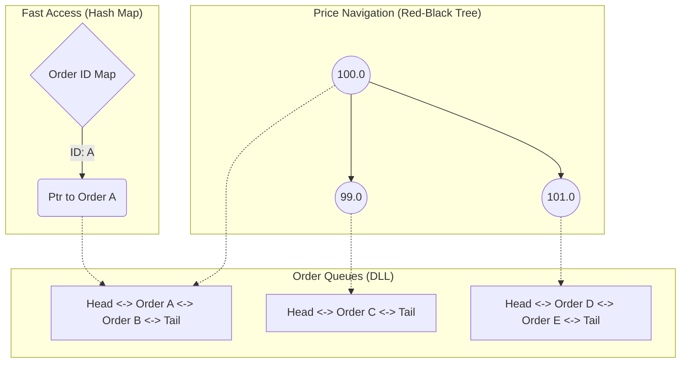

# 🧱 Engineering Brick: The Order Book Structure

> 🌸 *In the realm where microseconds define the king,*
> *The Tree holds the price, the List rules the ring.*

## 🌠 Signal & Context
**Scenario**: We are building the core Matching Engine for a high-frequency trading (HFT) exchange similar to NASDAQ or LMAX.
**The Constraints**:
* **Latency**: End-to-end processing must be under **100 microseconds** ($<100\mu s$).
* **Throughput**: 100,000+ orders per second per symbol.
* **The Hard Problem**: We need a data structure that maintains **strict price-time priority** while supporting **$O(1)$** cancellations and high-speed matching. Standard databases or generic collections are too slow.

---

## ⚡ The Design Dialogue (Socratic Review)

*In this section, I simulate a design review discussion to explore trade-offs between a Senior Engineer (The Challenger) and the System Architect.*

> **🕵️ The Challenger**: Let's keep it simple. An Order Book is just a list of buy and sell orders. Why can't we use a simple `ArrayList` or `Vector`? Arrays are cache-friendly.

**🧑‍💻 The Architect**:
Arrays are indeed CPU-cache friendly, but they fail at the **"Churn"** (insertion/deletion rate).
In trading, 90% of orders are cancelled before execution. If we remove an order from the middle of an array, we have to shift all subsequent elements. That is **$O(N)$**.
At 100k messages/second, an $O(N)$ operation will cause a latency spike that kills our SLA. We need something faster.

> **🕵️ The Challenger**: Fair point. If we need speed, why not a `HashMap`? It gives us **$O(1)$** for everything.

**🧑‍💻 The Architect**:
A HashMap is great for looking up *specific* items, but it has no concept of **Order**.
To match a trade, we always need the **Highest Bid** (Max) and the **Lowest Ask** (Min).
In an unordered HashMap, finding the Min/Max requires scanning the whole map, which is **$O(N)$**.
We need a structure that keeps data **Sorted** at all times.

> **🕵️ The Challenger**: Sorted? Then a Binary Search Tree (BST) or a Balanced Tree (AVL/Red-Black) is the textbook answer. **$O(\log N)$** for search, insert, and delete.

**🧑‍💻 The Architect**:
We are getting closer. A Red-Black Tree is excellent for maintaining **Price Levels** (e.g., $100.00, $100.05).
However, a Tree node represents a *Price*, not an *Order*. In a liquid market, thousands of orders can sit at the exact same price (e.g., 500 people wanting to buy Apple at $150).
How do we store those 500 orders inside a single Tree Node while respecting FIFO (First-In-First-Out)?

> **🕵️ The Challenger**: We can nest a Queue inside the Tree Node?

**🧑‍💻 The Architect**:
Exactly. But not just a simple Queue.
We need a **Doubly Linked List**.
* **Why?**: Traders often cancel orders *randomly* (not just from the head/tail). A Doubly Linked List allows us to remove a node from the middle in **$O(1)$** if we have a direct pointer to it.

---

## 💠 Pivot Insight: The "Pointer Map" Optimization
The complexity breaks when we realize we need **Three Structures** working in harmony to handle the "Cancel Order" operation efficiently.

1.  **The Tree**: To find the Best Price ($O(\log N)$).
2.  **The Linked List**: To manage the Queue at each price ($O(1)$ append/match).
3.  **The Order Map**: A HashMap mapping `OrderID -> NodePointer`.

Without the **Order Map**, cancelling a specific order would require searching through the lists ($O(N)$). With the map, we jump directly to the memory address of the order node and unlink it from the list in **$O(1)$**.

---

## 🛠 Implementation Blueprint

Here is the anatomy of our hybrid data structure:

### 🗝 The "Brick" Summary (Mental Model)

To recall this design instantly, I use the **"Order Book Composite"** model:

1. **Values**: **Price** (Key) & **Time** (Priority).
2. **Structure**:
* **Price**: Red-Black Tree (std::map / TreeMap).
* **Time**: Doubly Linked List within each Tree Node.
* **Access**: HashMap (OrderID -> Pointer) for  cancellations.

3. **Invariant**: `Best Bid < Best Ask`. If this is violated, a trade executes immediately.
4. **Complexity**: Match $O(1)$, Add $O(\log N)$, Cancel $O(1)$.

---

## ✨ Google Mindset & Follow-ups

### 🚀 1. The "Object Pooling" Optimization

In Java or C#, creating a new Object for every incoming order triggers **Garbage Collection (GC)**, causing "Stop-the-world" pauses.

* **Solution**: We pre-allocate 1,000,000 empty Order Objects at startup.
* **Technique**: When an order comes in, we borrow an object from the **Pool**. When it matches or cancels, we return it to the Pool. Zero allocation = Zero GC.

### ⚖️ 2. The "Flat Array" Extreme (HFT Deep Dive)

For extreme low latency, even the `Red-Black Tree` ($O(\log N)$) is too slow due to pointer chasing (Cache Misses).

* **Trade-off**: If the price range is bounded (e.g., 0 to 100,000 ticks), we can replace the Tree with a giant **pre-allocated Array**.
* **Direct Indexing**: `Price $105.50` -> `Index 10550`.
* **Result**: Access becomes strict **$O(1)$**. This consumes more RAM (Space-Time Tradeoff) but guarantees the lowest possible latency.

### 💡 3. Wisdom

System Design is not about choosing the "best" data structure, but composing the right structures to match the **access patterns**. In Trading, **Cancellation** is the most frequent operation, so we optimize for  removal.

---

🪷 *One sentence to trigger the reflex*: **"Tree finds the price, List keeps the line, Map kills the order, all in constant time."**

> **Next up**: In [Part 2](/posts/3.stock-exchange-2-matching-engine), we will breathe life into this static structure by building the **Matching Engine**. We will challenge the myth of multi-threading and explore the **LMAX Disruptor**.

