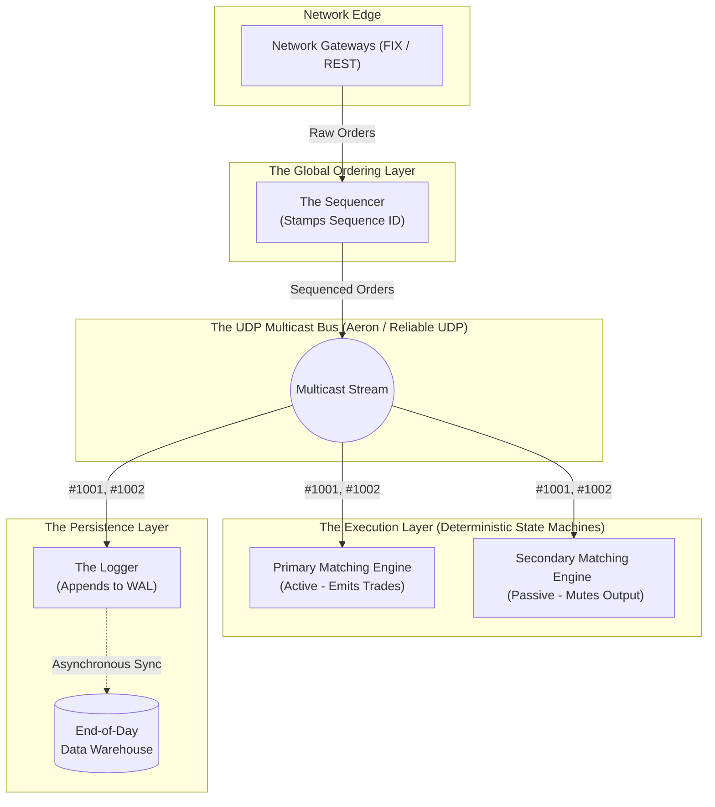

# 🧱 Engineering Brick: The Fault-Tolerant Exchange

> 🌸 *The core may crash, the power may fade,*
> *But the Log remembers every trade.*

Welcome to the final chapter of the Stock Exchange Core series.
In [Part 1](/posts/2.stock_exchange_order_book), we built the **Order Book** in RAM.
In [Part 2](/posts/3.stock_exchange_matching_engine), we confined the **Matching Engine** to a single CPU core using the LMAX Disruptor.

But a fatal question remains: **If the entire system lives in volatile RAM, what happens when the server loses power?** Today, we zoom out to the Macro Network Level to build a system that is blindingly fast, yet practically immortal.

## 🌠 1. The Formal Specification (Problem Model)
We must ensure High Availability (HA) and Disaster Recovery (DR) for our in-memory Matching Engine.

**The Constraints (SLA):**
* **Zero Data Loss:** Once an order is acknowledged to the trader, it must never be lost.
* **Failover Latency:** If the Primary Engine crashes, the Backup Engine must take over in $< 1$ millisecond.
* **The "No-Database" Rule:** Writing to a traditional database (PostgreSQL, MongoDB) requires Disk I/O or network round-trips taking $1 - 5$ milliseconds. Our latency budget is $< 50 \mu s$. **The engine must never wait for a disk.**

---

## ⚡ 2. The Design Dialogue (Socratic Review)

*I simulate an architectural review with a Database Expert (The Challenger) to break down the Event Sourcing mindset.*

> **🕵️ The Challenger**: To ensure we don't lose trades during a crash, we need to save the Order Book to a clustered database using a Two-Phase Commit (2PC).

**🧑‍💻 The Architect**:
Two-Phase Commits and distributed locks are the enemies of low latency. If our Single-Threaded Matching Engine pauses to wait for a database to acknowledge a write on a hard drive, our throughput drops from 100,000 TPS to 500 TPS.

> **🕵️ The Challenger**: If we don't save the state to a database, the state disappears when the RAM loses power. How do we recover?

**🧑‍💻 The Architect**:
We don't save the *State* (The Order Book); we save the *Inputs* (The Orders).
Our Matching Engine is a strictly **Deterministic State Machine**. If we feed the exact same sequence of orders into an empty engine, we will deterministically arrive at the exact same Order Book state. This is called **Event Sourcing**.

> **🕵️ The Challenger**: So we just log the inputs? What if two identical backup engines receive the inputs from the network in a slightly different order due to network jitter?

**🧑‍💻 The Architect**:
That is the fatal flaw of distributed systems. If Engine A sees `[BUY, CANCEL]` and Engine B sees `[CANCEL, BUY]`, their states will diverge. To fix this, we introduce a strict gatekeeper: **The Sequencer**.

---

## 🧩 3. The Architecture: Sequencer & UDP Multicast
To guarantee global order, no client connects directly to the Matching Engine. They connect to Gateways, which forward orders to the **Sequencer**.

1. **The Sequencer**: A highly optimized, lightweight component. Its only job is to receive an order, stamp it with a monotonically increasing `Sequence ID` (e.g., `#1001`, `#1002`), and broadcast it.
2. **UDP Multicast**: Instead of sending point-to-point TCP messages, the Sequencer uses UDP Multicast to blast the sequenced order to the network switch.
3. **The Replicated State Machine**: The Primary Engine, the Secondary (Backup) Engine, and the Logger all listen to this exact same UDP multicast stream. They all process `#1001` before `#1002`, guaranteeing perfectly synchronized parallel universes.

### The Macro Architecture Diagram

---

## 🔄 4. Lifecycle Walkthrough: Crash & Recovery
Let's trace how this architecture handles a catastrophic failure.

**T0: Normal Operation**
* The Sequencer multicasts Order `#1001`.
* **Primary Engine** receives `#1001`, matches it, updates its RAM, and sends the trade confirmation back to the Gateway.
* **Secondary Engine** receives `#1001`, matches it, updates its RAM, but *drops* the output. It acts as a hot-standby shadow.
* **The Logger** receives `#1001` and appends it to a Write-Ahead Log (WAL) on a fast NVMe SSD using memory-mapped files (`mmap`).

**T1: The Crash (Primary Engine Dies)**
* The motherboard of the Primary Engine catches fire.
* A cluster manager (e.g., ZooKeeper/Raft heartbeat) detects the failure.
* Within micro-seconds, the **Secondary Engine** is promoted to Primary. Because it has been processing the exact same multicast stream, its RAM is 100% identical to the dead engine. It simply stops muting its outputs and takes over. The traders notice zero downtime.

**T2: Total Cluster Failure (Disaster Recovery)**
* A power outage takes down both engines.
* When power returns, we boot up a fresh, empty Matching Engine.
* The engine reads the **Snapshot** from midnight (a compressed dump of the Order Book).
* The engine then reads the **Write-Ahead Log (WAL)** from the Logger, fast-forwarding and replaying every order from `#1` to `#1001`.
* Within seconds, the RAM is perfectly rebuilt.

---

## 💎 5. Deep Dive: The Network Extreme (For Practitioners)
*If you are building for Jane Street or Optiver, standard networking is too slow. You must bypass the OS kernel.*

**1. Reliable UDP (Aeron)**
Standard UDP doesn't guarantee delivery. If the network drops packet `#1002`, the Matching Engine will see `#1001` followed by `#1003`. It must immediately halt and send a NAK (Negative Acknowledgement) to the Sequencer to re-transmit `#1002`. Modern financial systems use **Aeron** (built by the creators of LMAX) to handle reliable UDP multicasting at microsecond latencies.

**2. Kernel Bypass (DPDK & Solarflare)**
When a packet arrives at a standard server, the Network Interface Card (NIC) raises a hardware interrupt, forcing the Linux Kernel to context-switch, copy the packet into kernel space, and then copy it into user space. This takes $> 10 \mu s$.
Elite HA systems use **Kernel Bypass (e.g., DPDK, Solarflare OpenOnload)**. The NIC writes the incoming UDP packet *directly* into the L1/L2 cache of the CPU core running our Single-Threaded Matching Engine. The OS doesn't even know the packet exists.

---

### 🗝 The "Brick" Summary (Mental Model)
* **🌠 Signal**: The need for zero-data-loss durability without the latency penalty of Disk I/O or Databases.
* **🧩 Structure**: Sequencer + UDP Multicast + Replicated State Machines (Primary/Secondary) + Append-Only WAL.
* **🏛 Invariant**: Determinism. `f(State_N, Sequence_N+1) -> State_N+1`. Identical inputs always produce identical state.
* **💠 Pivot Insight**: Decouple Execution from Persistence. The Engine does math in RAM; a completely separate Logger component handles the Disk I/O.

---

🪷 *One sentence to trigger the reflex*: **"The Sequencer stamps the time, Multicast spreads the rhyme, the Logger writes it down, and the Engine wears the crown."**

> **Conclusion**: This wraps up our deep dive into the **Stock Exchange Core**. We've journeyed from the micro-optimizations of a C++ Order Book to the macro-architecture of a Fault-Tolerant cluster. The principles of Mechanical Sympathy and Determinism remain the ultimate truth in low-latency system design.
