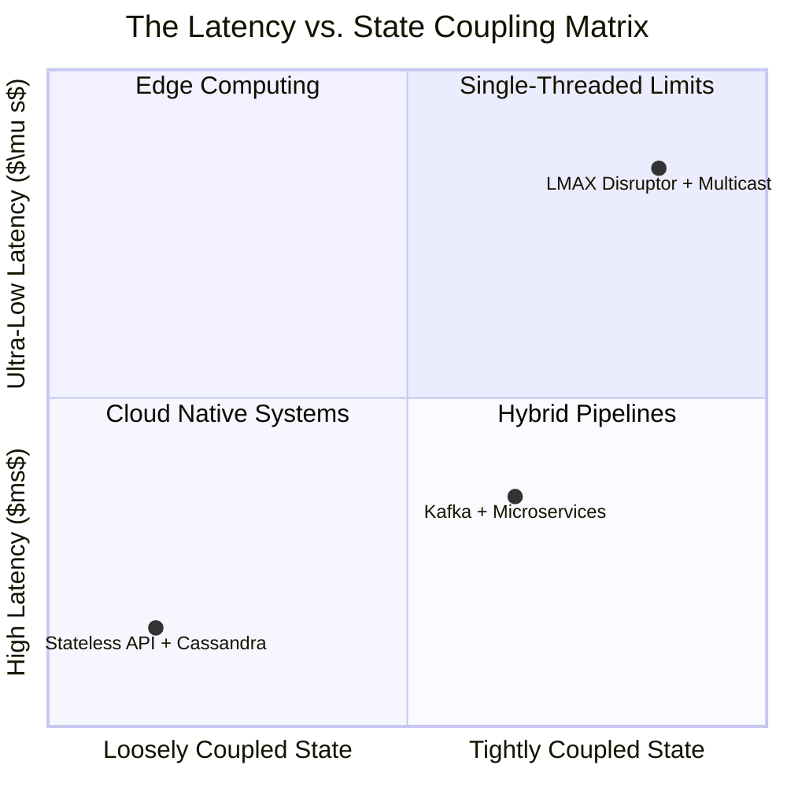

# 🧱 Engineering Brick: The Architect's Crucible

> 🌸 *To build the lightning, we must bind the core,*
> *But every speed has taxes at the door.*

Welcome to the Grand Finale of the Stock Exchange Core series. 
Over the last three parts, we constructed an ultra-low latency trading system: an $O(1)$ Order Book in RAM, a strictly Single-Threaded Matching Engine using the LMAX Disruptor, and a Fault-Tolerant network using Event Sourcing and UDP Multicast.

It sounds like the perfect system. **But perfection is an illusion in System Design.**
A Staff/Principal Engineer knows that every architecture is simply a collection of compromises. Today, we tear our own system down to understand its physical limits, its astronomical costs, and exactly when you should *never* build it.

---

## ⚖️ Design Principle 1: The CAP Theorem & The Speed of Light
In distributed systems, the CAP Theorem dictates that we can only choose two out of three: **Consistency (C), Availability (A), and Partition Tolerance (P)**. Where does our HFT architecture sit?

Within a single low-latency cluster (e.g., NY4 in New Jersey), we optimize for **strong consistency and fast failover** under the assumption of a healthy local network. If the Primary motherboard catches fire, the Secondary unmutes its output and takes over in $< 1$ millisecond.

Across geographic regions, however, **partition tolerance becomes unavoidable**, and the CAP trade-off reappears in full force. 
If the fiber link between our New York Data Center and our Chicago Disaster Recovery site goes down, we face a brutal choice bounded by physics. The speed of light in fiber dictates a minimum round-trip time (RTT) on the order of `~16 milliseconds` between NY and Chicago. 

If we choose **Synchronous Replication (CP)**, our matching engine must wait $16ms$ for Chicago to acknowledge every trade. Our latency budget is $50 \mu s$. This is physically impossible.
*👉 Elite exchanges choose **Asynchronous Replication (AP)** across regions. You cannot defeat Einstein.*

---

## 💰 Design Principle 2: The Brutal Cost of Mechanical Sympathy
The architecture we designed requires absolute hardware harmony. This demands extreme sacrifices in engineering ergonomics and budget. Let's quantify the reality.

**1. The Throughput Ceiling (Quantified Limits)**
A single CPU core pinned to a Lock-Free Ring Buffer is blindingly fast, but it has a hard physical ceiling. Even with highly optimized C++, a single core can reach an order of magnitude around **300,000 to 500,000 TPS (Transactions Per Second)**, depending on the instrument mix and hardware profile. You cannot scale it vertically anymore. If market volatility spikes beyond this limit, you must aggressively shed load at the network edge.

**2. The Hardware Tax ($$$)**
You cannot run this on standard AWS or GCP virtual machines.
* We require Bare Metal servers with CPU Pinning.
* We require specialized Solarflare NICs (Network Interface Cards) and Layer-1 switches to perform **Kernel Bypass (DPDK)**. 
A single rack of this proprietary hardware, combined with colocation space inside the NASDAQ datacenter, can easily require an upfront capital expenditure on the order of **$1M to $3M+**, excluding massive maintenance costs.

**3. The Observability Blindspot**
When you bypass the Linux Kernel to write packets directly into the CPU's L1 cache, standard monitoring tools (Datadog, `tcpdump`) become utterly blind. Attaching a debugger (`gdb`) to a production Matching Engine will halt the thread, overflow the network buffer, and crash the exchange.

---

## 🛑 The Anti-Pattern: When NOT to Build This
This is the most critical section for any aspiring Systems Architect. 

If you are building Amazon (E-commerce), Meta (Social Media), or Uber (Ride-hailing), applying a strictly ordered, single-threaded state machine is a catastrophic mistake.

* **The Mismatch:** HFT requires *Ultra-Low Latency* ($< 50 \mu s$) for a relatively small number of highly active symbols. Big Tech requires *Massive Scalability* (Millions of TPS globally) and can easily tolerate $100$ milliseconds of latency.
* **The Big Tech Solution:** At Big Tech scale, the dominant pattern is to push coordination to the edges: keep request-handling layers as stateless as possible, partition state aggressively, and reserve strong coordination only for the narrow parts of the system that truly need it.

*Use the right tool for the job. Do not bring a Formula 1 car to haul freight.*

---

## 🧠 Design Principle 3: The Stateful System Design Matrix
To summarize everything into a strict, reusable Principal-level mental model, here is the exact Decision Tree for stateful system design.

### The Latency vs. State Coupling Spectrum

* **IF Target Latency is $< 1$ millisecond AND State is Highly Coupled:**
  * 👉 **Do:** Use Single-Threaded State Machines + LMAX Disruptor + UDP Multicast/Aeron. 
  * 👉 *Use Cases:* Exchange Matching, Market Data Sequencing, Real-time Risk Gateways, Telecom Control Planes.
* **IF Target Latency is $5 - 50$ milliseconds AND State is Decoupled:**
  * 👉 **Do:** Use Apache Kafka (or Redis Streams) as the Sequencer + Horizontally Scaled Microservices.
  * 👉 *Use Cases:* Crypto Exchanges (Binance, Coinbase), Payment Gateways (Stripe). This balances speed with Cloud-Native operational simplicity.
* **IF Target Throughput is $> 1,000,000$ TPS AND Global Reach is required:**
  * 👉 **Do:** Use Stateless Microservices + Distributed Databases (Cassandra / DynamoDB / Spanner).
  * 👉 *Use Cases:* Social Media Feeds, E-Commerce Carts, Ride-Hailing.

> *👉 Ultimately, all system design reduces to three fundamental constraints: physics, cost, and coordination.*

---

### 🗝 The "Brick" Summary (Mental Model)
* **🌠 Signal**: Knowing the exact limits of an architecture and actively deciding when NOT to use it.
* **🧩 Structure**: The Explicit Decision Framework (Latency vs. Throughput vs. State Coupling).
* **🏛 Invariant**: Physical limits (Speed of light, CPU thermal thresholds) supersede software design. Cost is a functional requirement.
* **💠 Pivot Insight**: A Senior Engineer knows *how* to build a complex system. A Principal Engineer knows the physical boundaries of *why* and *when* to build it.

---

🪷 *One sentence to trigger the reflex*: **"Speed costs money, determinism bounds scale; Frame your physics and trade-offs, or your architecture will fail."**
