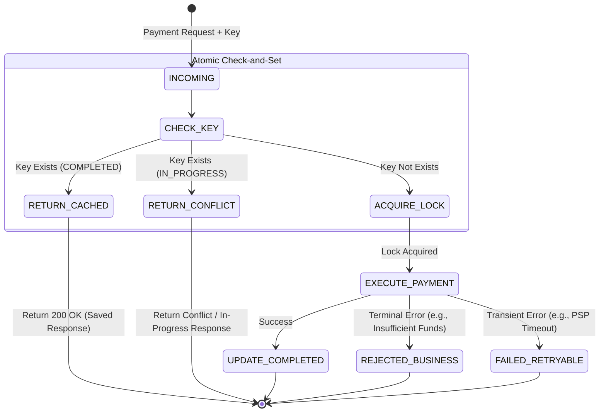

# 🧱 Engineering brick: The shield of financial correctness

> 🌸 *The network breaks, the retries fall,*
> *But the ledger must account for all.*

Welcome to the first chapter of the **Global Payment Gateway** series.

In our previous series on the *Stock Exchange Core*, we chased the physical limits of the speed of light, optimizing for sub-50 microsecond latency. We abandoned databases in the critical path to achieve raw throughput.

In the world of payments (think Stripe, Block, or Google Pay), the paradigm flips entirely. **We trade speed for absolute correctness.** A lost packet in a trading data feed is an annoyance; processing a $1,000 payment twice is a catastrophic financial, legal, and reputational failure.

Today, we explore the foundational shield of any payment system: **The idempotent API**.

---

## ⚖️ Design principle 1: The illusion of "exactly-once" delivery
Over an unreliable network, exactly-once delivery cannot be assumed.

Consider a user tapping the "Pay Now" button. The request travels to the gateway, the server commits the payment intent, and returns a success response. But a fraction of a second before the response reaches the user, their connection drops. From the server's perspective, it is done. From the client's perspective, it is a timeout. The client *must* safely retry.

In practice, we approximate exactly-once effects through retries, deduplication, and idempotent processing. An Architect must enforce this equation at the application layer:
*👉 At-Least-Once Delivery + Idempotent Receiver = Exactly-Once Processing Semantics.*

---

## 💰 Design principle 2: The anatomy of an idempotency key
An idempotent API guarantees that multiple identical requests have the same effect as a single request. The core mechanism is the `Idempotency-Key` passed in the HTTP Header. 

However, a Principal Engineer must distinguish between two types of duplication:

**1. Network-level duplication (The UUIDv4)**
The client generates a random `UUIDv4` for a specific action. If the network times out and the client retries, it sends the same UUID. This protects against network jitter and UI double-clicks.

**2. Business-level duplication (The fingerprint hash)**
What if a client bug generates a *new* UUID for a retry of the same logical order?
For critical paths, we generate a deterministic **Business Hash Fingerprint**:
`Hash(UserID + MerchantID + OrderID + Amount + Currency)`

By enforcing uniqueness on both the Client UUID and the Business Hash, we protect the ledger from both transient failures and deep logical flaws.

---

## 🧠 Design principle 3: The check-and-set lifecycle
Implementing idempotency is not just a simple `SELECT`. It requires a strict, atomic state machine to handle concurrent retry storms.

### The idempotency state machine

**The solution for race conditions:**
We must use atomic operations to acquire the lock. 
1. **In a SQL Database:** Rely on a `UNIQUE` constraint on the `idempotency_key`. Only the first `INSERT` succeeds.
2. **In a Distributed Cache:** Use Redis `SET NX` to atomically claim the key for the hot path. 
*👉 Note: Redis protects the hot path, but the durable source of truth must still live in a persistent store.*

---

## 🛑 The architect's crucible: Expiry and edge cases

**1. The storage tax (TTL)**
TTL depends on the product and settlement window; many APIs keep keys for hours, while regulated flows retain records longer in durable storage. Beyond that window, the client must initiate a new logical order.

**2. Payload mutation (The malicious retry)**
If a client sends Request A (Key: 123, Amount: $10) and then Request B (Key: 123, Amount: $100), the key is compromised.
*The Rule:* An idempotency key must be **deterministically bound to a canonical payload fingerprint**. If the system detects a known key but a mismatched hash, it must reject the request with a client error and surface an explicit mismatch code.

### The idempotency limits matrix
| Concern | What it protects against | What it does not solve |
| :--- | :--- | :--- |
| **Client UUID** | UI double-click, network retry | Business duplicates |
| **Business fingerprint** | Same logical order replay | Concurrent processing alone |
| **Unique constraint / SET NX** | Race conditions on the same key | Downstream PSP ambiguity |
| **TTL** | Unbounded storage growth | Long-tail reconciliation |

---

## 🧠 Socratic review: The principal's interrogation

**Q1: What if Redis loses power and loses the key before the TTL expires?**
* **Answer:** Redis is a high-speed shield. The *durable* source of truth is the relational database. The `UNIQUE` constraint on the DB will catch and reject the duplicate if the cache fails.

**Q2: A client modifies a retry payload but keeps the same key. Why is this a risk?**
* **Answer:** If we only check the key, we might process a different amount or return a stale success. Binding the key deterministically to the payload hash ensures integrity and triggers the Risk Engine on mismatches.

**Q3: We record the intent, but the server crashes before updating the status to 'COMPLETED'. What happens next?**
* **Answer:** The next retry might duplicate the business action. To prevent this, the business operation and the idempotency state creation **must** be committed within the same Database Transaction. 
*👉 **The Ambiguous Edge:** In real payment flows, the hardest cases are not clean failures, but ambiguous ones: the gateway times out while the PSP may already have accepted the charge. Idempotency prevents duplicate intent, but reconciliation is still required to resolve unknown external outcomes.*

---

### 🗝 The "brick" summary (Mental model)
* **🌠 Signal**: Safe processing over an unreliable, lossy network.
* **🧩 Structure**: Client Keys + Business Fingerprint + Atomic CAS State Machine.
* **🏛 Invariant**: Idempotency is not a caching strategy; it is a concurrency control and locking mechanism. 
* **💠 Pivot Insight**: Truth in distributed systems is never "exactly-once" by default; it is a state manufactured through careful coordination.

---

🪷 *One sentence to trigger the reflex*: **"The network will fail, the client will retry; lock the key atomically, and let the truth of the ledger reply."**
