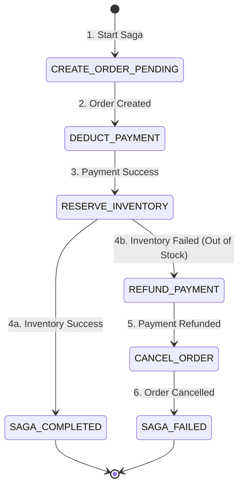

# 🧱 Engineering Brick: The Illusion of Immediate Consistency

> 🌸 *The network splits, the locks will bleed,*
> *But forward action plants the seed.*

Welcome to the second chapter of the **Global Payment Gateway** series.

In [Part 1](), we built the Idempotent API to ensure that network retries never result in double-spending. We secured the boundary. But modern payment systems are not monolithic databases.

When a user places an order on an e-commerce platform, the system must create an order, deduct the payment, and reserve the inventory. These operations span multiple microservices, each with its own isolated database. How do we guarantee that we never deduct funds for an out-of-stock item without relying on global locks?

Today, we dive into the heart of distributed transactions: **The Saga Pattern and The Transactional Outbox**.

---

## 🌠 The Formal Specification (Problem Model)
Before architecting the solution, we must define the failure domains of a cross-service transaction.

**The Interface**:
* `processCheckout(OrderID, UserID, Amount, ItemID)`: A workflow spanning the Order, Payment, and Inventory services.

**The Constraints**:
* **Business Atomicity**: The workflow must converge to a consistent business outcome. If later steps fail, earlier committed steps must be semantically compensated.
* **Isolation**: Microservices cannot share a database. Global distributed locks are strictly forbidden.
* **Availability**: The system must remain highly available, accepting orders even if the Inventory service experiences a temporary latency spike.

---

## ⚖️ Design Principle 1: The Fallacy of Two-Phase Commit (2PC)
In traditional academic system design, the answer to distributed transactions is the Two-Phase Commit (2PC). A coordinator asks all databases to prepare (lock rows), and only when all agree, it issues the commit command.

While theoretically sound, **2PC is often an unacceptable trade-off for high-availability microservice architectures.**

In a distributed system, waiting is death. If the Payment database prepares successfully, but the Inventory database times out due to a network partition, the Payment database must hold its locks indefinitely until the coordinator recovers. This violates our High Availability constraint.

In large-scale payment and commerce systems, holding synchronous locks across network boundaries leads to cascading failures. **Across service boundaries, we usually give up synchronous global consistency in favor of availability and forward recovery.**

---

## 💰 Design Principle 2: The Saga Pattern & Compensation
To scale without global locks, we replace 2PC with the **Saga Pattern**. 
A Saga breaks a global transaction into a sequence of isolated, local database transactions. Each local transaction updates its own database and publishes an event to trigger the next step.

However, if step 3 fails, we cannot simply issue a SQL `ROLLBACK` for steps 1 and 2, because those database transactions have already committed.

### The Principle of Semantic Compensation
Instead of technical rollbacks, Sagas rely on **Compensating Transactions**—semantic, business-level reversals. If the Inventory reservation fails, the Saga must execute a "Refund" transaction on the Payment service. 

In financial engineering, the ledger is immutable. You do not erase history; you append a new entry that negates the previous one. *Compensation is a business-level forward-recovery mechanism.*

### The Saga Orchestration State Machine

### Orchestration vs. Choreography
For complex financial workflows, we use **Saga Orchestration** (a centralized controller tracking the state) rather than *Choreography* (services reacting to each other's events).

| Model | Strength | Weakness |
| :--- | :--- | :--- |
| **Choreography** | Decoupled, simple for early stages | Hard to trace, cyclical flows |
| **Orchestration** | Centralized visibility, explicit control | Orchestrator complexity, extra state store |

Orchestration prevents cyclical dependencies and provides a single pane of glass for observability, which is mandatory for payment flows.

---

## 🧠 Design Principle 3: The Transactional Outbox
A Saga requires a service to update its local database and publish an event to a message broker (e.g., Kafka) to trigger the next step. 

**The Dual-Write Problem:**
If you update the database and then the Kafka publish call fails (due to a network blip), your system is giờ permanently inconsistent. The order is marked as paid locally, but the inventory service will never receive the message.

**The Solution:**
We use the **Transactional Outbox Pattern**. 
Instead of publishing to Kafka directly, the service writes the business entity (Payment Record) and the event (Payment_Success_Event) to an `outbox` table within the **exact same local database transaction**. 

Because they share a transaction, the write is 100% atomic. An asynchronous relay process then reads the `outbox` table and reliably publishes the messages to Kafka. *This closes the dual-write gap between the database and the message bus.*

---

## 🗣️ The Design Dialogue (Socratic Review)

*A true Architect does not just build systems; they anticipate how they break. Let's test this mental model against the edge cases that crash startups.*

> **🕵️ The Challenger**: You mentioned that if Inventory fails, the Orchestrator fires a "Refund" compensating transaction to the Payment service. What happens if the network drops and the Orchestrator retries that Refund command 3 times? Won't we refund the user 3 times?

**🧑‍💻 The Architect**:
That is exactly why **Sagas cannot exist without Idempotency**. Every compensating transaction must be strictly idempotent. When the Orchestrator fires the Refund, it passes the original `SagaID` as the Idempotency Key. The Payment service will recognize the duplicate retries and safely ignore them, ensuring the user is only refunded once. 

> **🕵️ The Challenger**: What if the Saga Orchestrator server suffers a catastrophic hardware failure right sau step 2 (Payment Success), but before it can initiate step 3 (Inventory)? 

**🧑‍💻 The Architect**:
This is the danger of dangling states. A resilient Saga implementation requires a **Recovery Sweeper**. The Orchestrator's state machine is persisted in a database. A recovery sweeper periodically scans for timed-out sagas (e.g., stuck in `PAYMENT_SUCCESS` beyond a defined TTL). It will then forcefully resume the Saga hoặc trigger the compensation workflow to heal the system.

> **🕵️ The Challenger**: If we process 10 million Sagas a day, doesn't writing every single state transition to the Orchestrator's database create a massive bottleneck? 

**🧑‍💻 The Architect**:
If designed poorly, yes. But we do not use the Orchestrator's database for complex SQL joins. It is a highly optimized state store. At higher scale, the saga state store can evolve from a relational table into a key-value or wide-column store (like Cassandra or Google Bigtable) optimized for append-heavy state transitions.

---

### 🗝 The "Brick" Summary (Mental Model)

* **🌠 Signal**: The need to execute multi-step business workflows across isolated microservice databases without sacrificing availability.
* **🧩 Structure**: Saga Orchestrator + Compensating Transactions + Transactional Outbox.
* **🏛 Invariant**: Local transactions are atomic; global workflows converge through eventual consistency and compensation.
* **💠 Pivot Insight**: Never use technical rollbacks for distributed systems. Compensation is a business-level forward-recovery mechanism. Write the failure into the ledger, do not erase the past.

---

🪷 *One sentence to trigger the reflex*: **"Don't lock the world to stay safe; orchestrate the flow and write the compensation, for eventual consistency is often the practical path to scale."**

> **Next up**: In [Part 3](), we move from workflow coordination to the absolute truth of money. How do you design a database that handles thousands of concurrent transactions trying to update the exact same merchant wallet? We dive into **The Contended Ledger: Correctness Under Concurrency.**
