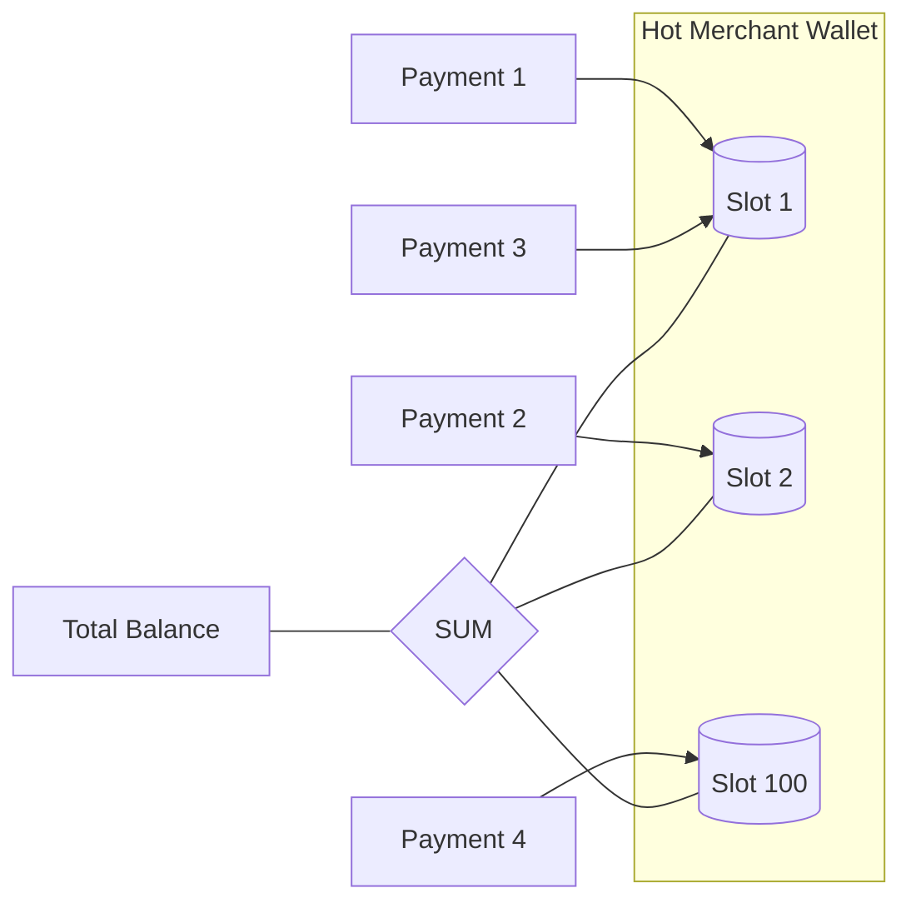

# 🧱 Engineering Brick: The Immutable Truth of Money

> 🌸 *The balance shifts, the entries fly,*
> *Only the journal will never lie.*

Welcome to the third chapter of the **Global Payment Gateway** series.

In [Part 2](), we coordinated distributed workflows using Sagas. We ensured that if one service fails, the system eventually converges to a consistent state. But eventually, every payment flow hits a single point of truth: **The Ledger**.

In a naive system, updating a user's balance is a simple `UPDATE` statement. But at scale—think of an Uber driver wallet receiving thousands of micro-payments, or a massive merchant account during Black Friday—a single database row becomes a bottleneck. This is the "Hot Account Contention" problem.

Today, we move beyond simple CRUD to architect a ledger that remains 100% correct under extreme concurrency.

---

## 🌠 The Formal Specification (Problem Model)
The Ledger is the ultimate record of every cent moving through our system.

**The Interface**:
* `postTransaction(DebitAccount, CreditAccount, Amount)`: Record a movement of funds between two entities.

**The Constraints**:
* **Strict ACID**: No money can be created or destroyed. Double-entry bookkeeping is mandatory.
* **No Over-drafting**: A transaction must fail if the source account has insufficient funds.
* **High Throughput**: The system must handle 10,000+ updates per second on a single "hot" account without causing database deadlocks.

---

## ⚖️ Design Principle 1: Balance is a Derived State
The biggest mistake in ledger design is treating the `balance` column as the source of truth. In financial engineering, **the Ledger is Immutable.**

You do not update a balance; you **append a journal entry.**

If you treat the balance as a mutable variable, you lose the audit trail and invite race conditions. Instead, we embrace **Event Sourcing** logic:
* The **Journal** (Append-only) is the Chân lý (Source of Truth).
* The **Balance** is merely a cached projection (Derived State) of all journal entries.

By shifting our mindset from *Updates* to *Appends*, we transform a contention-heavy write into a high-speed sequential insert.

---

## 💰 Design Principle 2: Optimistic vs. Pessimistic Control
When multiple transactions try to move money from the same account simultaneously, we must enforce a lock.

### 1. Pessimistic Locking (`SELECT FOR UPDATE`)
This is the "Safe but Slow" path. It locks the row, forcing all other transactions to wait.
* **Verdict:** At 1,000+ TPS, this leads to massive lock contention, increased latency, and eventually, database timeouts. It kills throughput.

### 2. Optimistic Concurrency Control (OCC)
We use a version-based check: `UPDATE accounts SET balance = new_balance, version = version + 1 WHERE id = 123 AND version = current_version`.
* **Verdict:** Great for low contention. Under high contention, 99% of retries will fail, wasting CPU cycles and database IO.

**The Principal's Choice:** We use **Pessimistic Locking** only for the final commitment in the database transaction, but we minimize the lock duration by moving all business logic (validation, risk checks) *outside* the lock boundary.

---

## 🧠 Design Principle 3: Sharding the Hot Account (Sub-Ledgers)
What if the traffic exceeds the physical limits of a single database row? We apply a "Divide and Conquer" strategy: **Account Sharding.**

Instead of one logical account being represented by one physical row, we shard the "Hot" account into $N$ internal slots (e.g., 100 slots).
* **Writes:** Incoming credits are randomly routed to one of the 100 slots. Instead of 10,000 threads fighting for 1 row, they are now distributed—only 100 threads per row.
* **Reads:** To get the total balance, we sum all 100 slots.

---

## 🗣️ The Design Dialogue (Socratic Review)

> **🕵️ The Challenger**: If balance is just a "Derived State," doesn't that mean every time a user wants to see their balance, I have to sum millions of journal entries? That's an $O(N)$ disaster.

**🧑‍💻 The Architect**:
Correct. We solve this with **Snapshotting**. We maintain a `snapshots` table that stores the balance as of a specific `TransactionID`. When calculating the current balance, we take the latest snapshot and only sum the journal entries created *after* that snapshot. This keeps the read cost constant ($O(1)$) regardless of the account's age.

> **🕵️ The Challenger**: Sharding a wallet into 100 slots works for credits (deposits). But how do you handle a **Withdrawal**? If the user has $10 spread across 100 slots ($0.10 each), and they want to withdraw $5, which slot do you deduct from?

**🧑‍💻 The Architect**:
This is where complexity lives. For withdrawals, we use a **Routing & Rebalancing** strategy. The system attempts to find a slot with sufficient funds. If no single slot can cover the amount, we must execute a "Slot Consolidation" (internal transfer) to merge funds before the withdrawal. However, for most high-scale systems, withdrawals are far less frequent than credits, allowing us to optimize for the credit path.

> **🕵️ The Challenger**: Why not just use a Distributed Cache (Redis) to store the balance and update the DB asynchronously?

**🧑‍💻 The Architect**:
In Fintech, **Availability is nothing without Integrity.** A cache is volatile. If the power fails and Redis loses the increment before it hits the DB, you have just "deleted" money. In a Ledger, every single cent must be accounted for within the same ACID transaction that records the journal entry. We can use Redis to *display* the balance, but we never use it to *validate* a transaction.

---

### 🗝 The "Brick" Summary (Mental Model)

* **🌠 Signal**: Massive concurrent updates to a single logical entity (Hot Wallet).
* **🧩 Structure**: Immutable Journal + Derived Balance + Snapshotting + Sub-ledger Sharding.
* **🏛 Invariant**: The sum of all journal entries must always equal the total minted currency. No erasers, only reversals.
* **💠 Pivot Insight**: Treat the database row not as a variable to be changed, but as a lock to be managed. To scale, you must break the lock into fragments.

---

🪷 *One sentence to trigger the reflex*: **"Don't update the truth, append to it; when the row burns hot, shard the fire."**

> **Next up**: We have perfected the internal ledger. But our gateway is still an island. In the final [Part 4](), we tackle the ultimate "Unknown": **Reconciliation & Settlement. How do you find the truth when your internal records and the Bank's reports don't match?**
