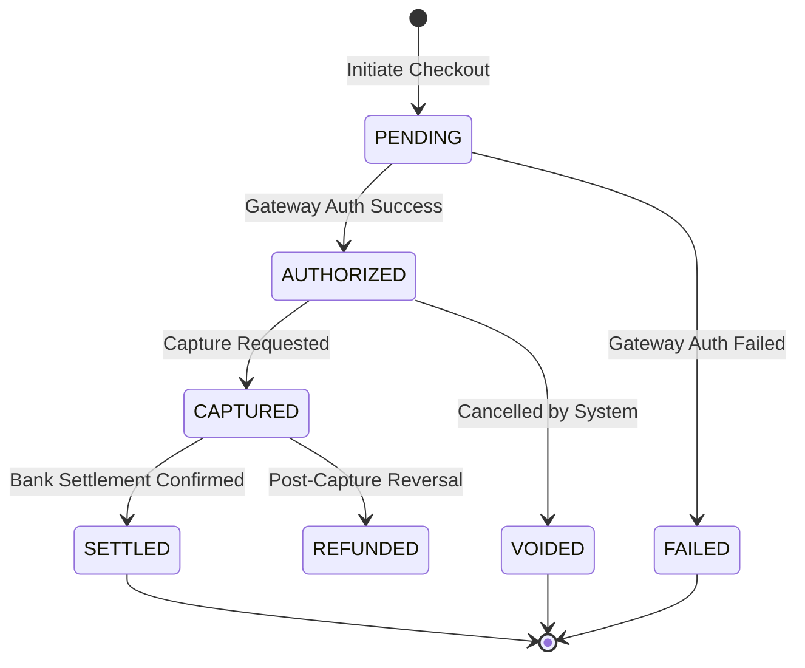

# 🧱 Engineering Brick: The Final Audit of Reality

> 🌸 *The internal ledger counts every coin,*
> *But the external world decides where they join.*

Welcome to the grand finale of the **Global Payment Gateway** series.

In [Part 3](), we perfected our internal ledger. We built a system capable of handling thousands of concurrent transactions without sacrificing financial correctness. If we lived in a closed simulation, our job would be done.

But a payment gateway does not exist in a vacuum. It must interact with the external world: Payment Processors (Stripe, Adyen), Payment Networks (Visa), and Central Banks (SWIFT). The internet is unreliable, external APIs experience outages, and webhooks get dropped.

How do you guarantee that the 100 USD recorded in your internal database actually arrived in your corporate bank account? Today, we tackle the ultimate challenge of distributed finance: **External State Consensus and Automated Reconciliation.**

---

## 🌠 The Formal Specification (Problem Model)
Our internal system must synchronize its state with the global financial network, absorbing its latency and failures.

**The Constraints**:
* **Data Consistency**: The internal ledger must perfectly reflect the external bank reports. Discrepancies must be detected and alerted.
* **Fault Tolerance (Resilience)**: The system must recover gracefully if an external provider drops a webhook or experiences a catastrophic outage.
* **Double-Entry Compliance**: The system must adhere to strict accounting principles to track money floating in transit.

---

## 🌐 1) Design Principle 1: The Illusion of Money Movement
To architect a global payment system, you must unlearn a fundamental myth: **Money does not physically move across borders.** When a customer in Vietnam buys a product from Walmart in the US, cash is not flown across the ocean. The movement of funds is entirely handled via **Correspondent Banking** and the **SWIFT** messaging network.
* **Nostro (Ours)**: Our bank's account held at another bank.
* **Vostro (Yours)**: Another bank's account held at our bank.

When a payment is captured, SWIFT simply sends a secure message: *"Bank A, please debit the customer and credit Bank B's Vostro account."* Because global payments are essentially asynchronous messages altering database rows across different financial institutions, discrepancies are mathematically inevitable.

---

## ⚖️ 2) Design Principle 2: The Payment State Machine
Because we are dealing with asynchronous network messages, a transaction is not a binary `Success` or `Fail`. We must design a robust State Machine.

1. **Tokenization**: To comply with PCI-DSS, we never store credit card numbers. We exchange them for a `Token` via a gateway.
2. **Authorization (Hold)**: We ask the issuing bank to verify funds and place a hold. The money hasn't moved, but the customer cannot spend it elsewhere.
3. **Capture**: We trigger the actual movement of funds.
4. **Settlement**: Days later, the funds finally arrive in our merchant bank account.



*Architectural Rule:* Your internal ledger must never assume a transaction is `SETTLED` just because the `CAPTURE` API call returned a 200 OK.

---

## 🪞 3) Design Principle 3: The Reconciliation Engine
If SWIFT and Gateways rely on asynchronous messaging, we must build an engine to verify that every message resulted in actual funds. This is the **Reconciliation Engine**.

Reconciliation is a specialized batch-processing pipeline that compares our Internal Ledger against the External Settlement Reports provided by our banks (usually via SFTP as CSV/XML files).

At Walmart's scale (billions of rows), standard SQL databases will choke. We extract data into a Columnar Data Warehouse (like Google BigQuery) and perform a massive `FULL OUTER JOIN` using the `ExternalReferenceID` as the anchor.

```sql
-- The Core Reconciliation Logic
SELECT
    COALESCE(internal.reference_id, bank.trace_id) AS correlation_id,
    CASE
        WHEN bank.trace_id IS NULL THEN 'MISSING_IN_BANK'
        WHEN internal.reference_id IS NULL THEN 'GHOST_TRANSACTION'
        WHEN internal.status != 'SETTLED' THEN 'STATUS_MISMATCH'
        ELSE 'IN_SYNC'
    END AS recon_status
FROM internal_ledger internal
FULL OUTER JOIN bank_settlement bank
ON internal.reference_id = bank.trace_id
WHERE (bank.trace_id IS NULL OR internal.reference_id IS NULL OR internal.status != 'SETTLED');
```

A `FULL OUTER JOIN` catches both scenarios: transactions we recorded but the bank missed, and transactions the bank charged but we somehow dropped.

---

## 🛡️ 4) Design Principle 4: Defensive Engineering
Connecting to external networks invites external chaos. We must deploy structural defenses.

### a. Circuit Breakers (Protecting the Resources)
If an upstream pricing service or external gateway becomes unresponsive, waiting for a timeout (e.g., 30 seconds) will quickly exhaust your server's thread pool. This leads to a cascading failure.
* **The Fix**: We use a **Circuit Breaker** (often handled by a Service Mesh like Istio). If the error rate exceeds a threshold, the circuit trips (`OPEN`). We immediately fail-fast (rejecting the request in 1 millisecond) or return stale cache data, saving our internal cluster from freezing.

### b. The Dead Letter Queue (Isolating Poison Pills)
Transient network errors deserve a retry. But what if the payload is permanently malformed (e.g., an invalid `FeedID`)?
* **The Fix**: Blindly retrying will clog the pipeline. We route these poison pills to a **Dead Letter Queue (DLQ)**. By attaching metadata (`X-Error-Reason`, `X-Original-Topic`), engineers can query the DLQ, fix the root cause, and manually replay the messages without blocking healthy traffic.

---

## 🧠 5) The Design Dialogue (Socratic Review)

*A true Architect does not just build systems; they anticipate the chaos of the real world.*

> **🕵️ The Challenger**: What happens if Stripe successfully processes the payment, but their Webhook notifying our system fails to deliver?

**🧑‍💻 The Architect**:
Never trust the network, and never rely solely on webhooks for financial state transitions. Webhooks are for latency optimization (speed). We must also implement a **Polling Fallback** (a cron job that actively queries Stripe for pending statuses) and rely on the nightly **Reconciliation Engine** (truth) to catch any orphaned states.

> **🕵️ The Challenger**: Why use BigQuery for reconciliation instead of running a script against our transactional SQL database?

**🧑‍💻 The Architect**:
Running heavy analytical queries (`FULL OUTER JOIN`) on an operational database degrades customer-facing performance. BigQuery uses a columnar storage architecture and separates compute from storage. It can scan billions of rows in seconds without impacting our real-time payment API.

> **🕵️ The Challenger**: If a downstream service fails, shouldn't we just use Kafka to buffer the request and retry indefinitely? Why do we need a Circuit Breaker?

**🧑‍💻 The Architect**:
Kafka is excellent for asynchronous background tasks. But for synchronous user-facing calls (e.g., fetching a price before checkout), the user is waiting. If the downstream is hanging, your HTTP threads will be exhausted waiting for a response. A Circuit Breaker protects your server's immediate resource limits by failing fast.

---

### 🗝 The "Brick" Summary (Mental Model)

* **🌠 1) Signal**: The need to synchronize internal system state with chaotic external financial networks.
* **🧩 2) Structure**: Tokenization + Payment State Machine + Batch Reconciliation (BigQuery) + Defensive Gates (Circuit Breakers & DLQ).
* **🏛 3) Invariant**: Double-entry bookkeeping. Every pending external movement must be tracked until mathematical consensus is reached via the `ExternalReferenceID`.
* **💠 4) Pivot Insight**: Money movement is an illusion; it is simply State Consensus. When the network drops messages, Reconciliation is the ultimate anchor of truth.

---

🪷 *One sentence to trigger the reflex*: **"Webhooks are for speed, reconciliation is for truth; isolate the poison with DLQ, and sever the connection to survive the storm."**

> **Series Conclusion**: We have traversed the entire Global Payment Gateway architecture. From securing the entry boundary with **Idempotency** (Part 1), coordinating workflows with **Sagas** (Part 2), scaling the **Contended Ledger** (Part 3), to enforcing absolute truth via **Reconciliation** (Part 4). This is the blueprint for processing millions of transactions without losing a single cent.
