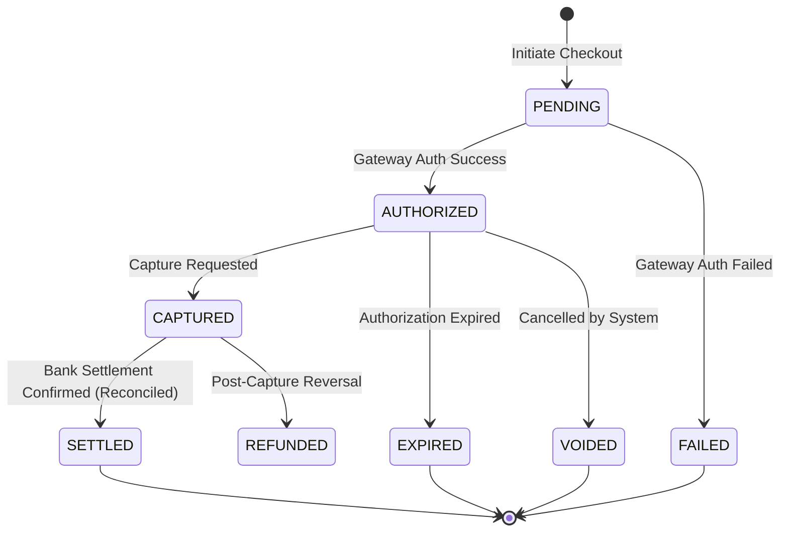

# 🧱 Engineering Brick: The Final Audit of Reality

> 🌸 *The internal ledger counts every coin,*
> *But the external world decides where they join.*

Welcome to the grand finale of the **Global Payment Gateway** series.

In [Part 3](), we perfected our internal ledger. We built a system capable of handling thousands of concurrent transactions without sacrificing financial correctness. 

Most engineers think a payment is done when the API returns 200 OK. **Real payment systems don’t.** They ask: *did the money actually settle in the bank account?*

Internal systems do not become correct at the API boundary; they become correct through reconciliation with external truth. Today, we tackle the ultimate operational challenge of distributed finance: **Reconciliation, Settlement, and the Architecture of Trust.**

---

## 🌠 The Formal Specification (Problem Model)
Our internal system must synchronize its state with the chaotic reality of external financial networks.

**The Constraints**:
* **Data Consistency**: The internal ledger must be reconciled against external settlement reports, and every discrepancy must be explainable, resolved, or escalated.
* **The Repair Loop**: Discrepancies must be classified, alerted, and resolved through compensating actions.
* **Fault Tolerance (Resilience)**: The system must survive dropped webhooks, transient network failures, and poisoned data payloads.

---

## 🌐 1) Design Principle 1: The Asynchronous Reality of Value Transfer
To architect a global payment system, you must understand the difference between *authorization* and *settlement*. Card payments, bank transfers, and cross-border payments use different rails, but they share the same architectural truth: our internal ledger is only one view of reality.

1. **Card Networks via PSPs:** When a user pays, the system immediately *authorizes* the transaction (putting a hold on funds). However, the actual *settlement* happens days later in a batch process.
2. **Cross-Border Flows:** In international transfers, value is not physically transported; institutions exchange authenticated messages and settle obligations through correspondent accounts (Nostro/Vostro).

Because all external integrations rely on delayed agreements, **temporary divergence is inevitable. Reconciliation is the mechanism that turns asynchronous messages into accounting truth.**

---

## ⚖️ 2) Design Principle 2: The Payment State Machine
Because settlement is delayed, your internal ledger must never assume a transaction is `SETTLED` just because the `CAPTURE` API call returned success. We must design a rigid State Machine.


*(Note: Real systems often extend this with `CHARGEBACK` and `DISPUTE` states to handle post-settlement conflicts).*

*Architectural Rule:* Webhooks are for speed (transitioning to `CAPTURED`); reconciliation is for truth (transitioning to `SETTLED`).

---

## 🪞 3) Design Principle 3: The Reconciliation Control Loop
Reconciliation is not simply a `JOIN` operation; it is an operational repair loop.

### Phase 1: Ingest & Match
We extract data from our Internal Ledger and ingest external settlement reports from our PSPs/Banks into a Data Warehouse capable of scanning large, partitioned datasets efficiently (e.g., Google BigQuery) without impacting the transactional payment path.

We perform a `FULL OUTER JOIN` using the `ExternalReferenceID` as the anchor.

```sql
-- The Reconciliation Matching Logic
SELECT 
    COALESCE(internal.reference_id, bank.trace_id) AS correlation_id,
    CASE 
        WHEN bank.trace_id IS NULL THEN 'INTERNAL_ONLY' 
        WHEN internal.reference_id IS NULL THEN 'BANK_ONLY' 
        WHEN internal.amount != bank.net_amount + bank.fee THEN 'AMOUNT_MISMATCH'
        WHEN internal.currency != bank.currency THEN 'CURRENCY_MISMATCH'
        WHEN internal.settlement_date != bank.settlement_date THEN 'DATE_MISMATCH'
        WHEN internal.status != 'SETTLED' THEN 'STATUS_MISMATCH' 
        ELSE 'IN_SYNC'
    END AS recon_status
FROM internal_ledger internal
FULL OUTER JOIN bank_settlement bank 
ON internal.reference_id = bank.trace_id;
```
*(Note: In production, duplicate external reference detection usually requires a separate aggregation step before the join).*

### Phase 2: Classify, Repair, and Close
Once discrepancies are identified, the system must act:
1. **Classify**: Categorize the error.
2. **Repair**: Generate an adjustment journal entry to correct the ledger, retry a failed capture, or open a manual review case for Finance Ops.
3. **Close**: Once all discrepancies are resolved, the accounting period is frozen. The ledger becomes the auditable book of record for that accounting period.

---

## 🛡️ 4) Design Principle 4: Defensive Engineering for External Calls
When connecting to external environments, failures will occur. We must protect our internal cluster.

### a. Circuit Breakers (Protecting Synchronous Paths)
For synchronous calls (e.g., PSP APIs, FX quote providers, fraud-scoring services), waiting for a timeout will quickly exhaust your server's thread pool. 
* **The Fix**: Use a **Circuit Breaker**. If the error rate exceeds a threshold, the circuit trips (`OPEN`), failing fast and preventing a cascading failure across your internal microservices.

### b. The Dead Letter Queue (Isolating Asynchronous Poison)
For asynchronous workflows (e.g., settlement-file ingestion pipelines), transient errors require a retry policy. But permanent errors (e.g., malformed rows, unknown merchant IDs) will clog the pipeline.
* **The Fix**: Route these poison pills to a **Dead Letter Queue (DLQ)**. This isolates the toxic payload, allowing the main pipeline to continue processing healthy settlements while Finance Ops investigates.

---

## 🧠 5) The Design Dialogue (Socratic Review)

*A true Architect anticipates the chaos of the real world.*

> **🕵️ The Challenger**: What happens if Stripe successfully processes the payment, but their Webhook notifying our system fails to deliver?

**🧑‍💻 The Architect**:
Never trust the network. We implement a **Polling Fallback** (a cron job querying pending statuses) to catch immediate failures. If both the webhook and the polling fail, the nightly **Reconciliation Engine** will flag the discrepancy (`BANK_ONLY` - the bank has the record, but we do not). Our repair loop will then verify the external reference and either backfill the missing ledger entry or open a Finance Ops review case depending on strict financial policy.

> **🕵️ The Challenger**: During reconciliation, what happens if the bank report shows a transaction that does not exist in our Internal Ledger (`BANK_ONLY`)? Should we auto-refund the customer?

**🧑‍💻 The Architect**:
No. Auto-refunding is financially dangerous because the discrepancy could simply be delayed ingestion, a duplicate report line, or a bank fee adjustment. The engine must quarantine the case, verify the external reference, and then either backfill the missing ledger entry, trigger a refund, or route it to Finance Ops depending on policy.

> **🕵️ The Challenger**: Why use BigQuery for reconciliation instead of running a script against our transactional SQL database?

**🧑‍💻 The Architect**:
Reconciliation requires massive analytical queries. Running a `FULL OUTER JOIN` on an operational database degrades customer-facing performance. A Data Warehouse separates compute from storage, scanning large partitioned datasets efficiently without impacting the transactional payment path.

---

### 🗝 The "Brick" Summary (Mental Model)

* **🌠 1) Signal**: The need to synchronize internal system state with external financial reality.
* **🧩 2) Structure**: Payment State Machine + Batch Reconciliation Repair Loop + Defensive Gates (Circuit Breakers & DLQ).
* **🏛 3) Invariant**: A payment system is not correct because every service succeeded; it is correct because every external obligation can be matched, explained, and closed.
* **💠 4) Pivot Insight**: Delayed agreement is inevitable. Reconciliation is the mechanism that turns asynchronous messages into accounting truth.

---

🪷 *One sentence to trigger the reflex*: **"Webhooks are for speed, reconciliation is for truth; isolate the poison with DLQ, and sever the connection to survive the storm."**

> **Series Conclusion**: We have traversed the entire Global Payment Gateway architecture. From securing the entry boundary with **Idempotency** (Part 1), coordinating workflows with **Sagas** (Part 2), scaling the **Contended Ledger** (Part 3), to enforcing operational truth via **Reconciliation** (Part 4). This is the blueprint for processing millions of transactions while making every cent traceable, explainable, and recoverable.
