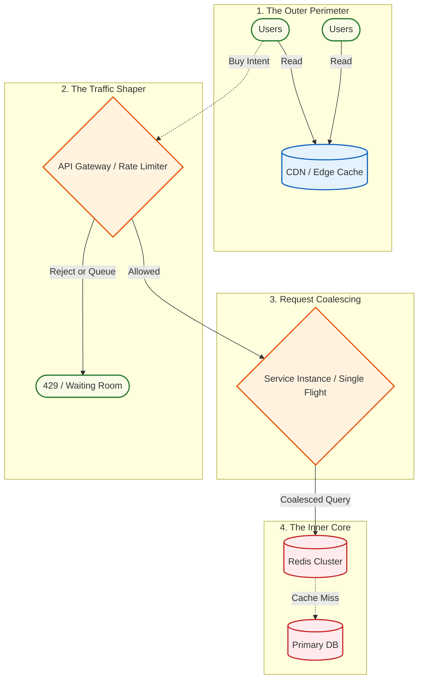

# 🧱 Engineering Brick: The Perimeter Defense

> 🌸 *The floodgates open, the masses crash,*
> *Only the filtered drops shall pass.*

Welcome to the **Global Flash Sale Engine** series. 

In our previous series, we architected a payment gateway designed to never lose a single cent. But what happens before the payment? What happens when marketing launches a campaign offering a 90% discount on a flagship product, starting exactly at 00:00:00?

One million users will refresh their apps at the exact same millisecond. In distributed systems, this is not a traffic spike; it behaves like a self-inflicted Distributed Denial of Service (DDoS) attack. This phenomenon is known as the **Thundering Herd**.

If even a small percentage of that traffic reaches an unprotected relational database, the storage layer can become the first point of collapse, triggering cascading failures that will end the sale in a catastrophic outage. 

Today, we learn how to survive the first second.

---

## 🌠 1) The Formal Specification (Problem Model)

A flash sale engine operates under extreme burst conditions. The architecture must prioritize survival over guaranteed service for every request.

**The Interface**:
* `getProductDetails(ProductID)`: Fetch read-heavy item metadata.
* `requestPurchaseToken(UserID, ProductID)`: The intent to buy.

**The Constraints**:
* **Extreme Read-to-Write Ratio**: Before 00:00:00, millions of users are refreshing the product page (Reads).
* **Instantaneous Burst**: Traffic scales from 1,000 Requests Per Second (QPS) to 1,000,000 QPS in under a second. Auto-scaling groups are too slow to react.
* **Core Protection**: The primary database must be shielded at all costs.

---

## 🌐 2) Design Principle 1: Edge Caching & The Stale-While-Revalidate Pattern

The first line of defense is geographical. You cannot process 1 million requests in your core data center. You must push the data to the edge (Content Delivery Networks - CDNs).

Product details, images, and static inventory counts are cached at the edge. However, when the cache expires, you face the **Cache Stampede**.

To prevent this, we use the `stale-while-revalidate` cache-control directive. 
* When the cache expires, the CDN does *not* block users to fetch new data. 
* Instead, it immediately serves slightly stale data to the vast majority of users, while asynchronously sending a small number of background requests to the core to fetch the fresh data. 

**Production Note:** In practice, this is usually implemented through CDN cache-control policies, not application-level caching. The exact directive depends on the CDN and cache layer, but the architectural goal is the same: serve stale data quickly while refreshing the origin asynchronously.

---

## ⛩️ 3) Design Principle 2: Ruthless Traffic Shaping

Not all traffic is legitimate, and your system has a physical limit. An architect must design the "Shedding" mechanism.

### 🔧 The Token Bucket Algorithm

To protect the `requestPurchaseToken` API, we implement Rate Limiting using the Token Bucket algorithm at the API Gateway level.

* The bucket holds tokens representing the safe request budget of the edge and application layer.
* During the first second, 1 million requests arrive. The gateway does not try to forward all of them to the core. It first filters obvious bots, duplicate retries, and abusive traffic.
* Legitimate users who pass the edge checks are redirected into a Virtual Waiting Room instead of directly hitting the inventory or checkout path.
* Only a controlled slice of users will later receive admission tokens and proceed toward the transactional core.

This layer does not decide who ultimately gets the item. It only prevents raw traffic from crossing the core boundary. The actual admission policy is handled by the Virtual Waiting Room in [Part 2]().

**Production Note:** In production, rate limiting is rarely based on IP alone, which fails badly behind corporate NATs or mobile carrier networks. A flash-sale gateway usually combines user ID, session ID, product ID, device/risk signals, and edge clearance state to decide whether traffic is rejected, slowed down, or sent into the waiting room.

---

## 🌌 4) Design Principle 3: Request Coalescing (The Single Flight Pattern)

This is one of the most powerful defensive patterns for read-heavy hotspots. 

Despite Edge Caching, some dynamic requests will inevitably reach your internal microservices. If a Redis key gets evicted or becomes a "Hot Key," your caching layer can still be overwhelmed.

**The Single Flight Pattern** ensures that if thousands of concurrent threads ask for the exact same resource (e.g., Product 999), the application server will coalesce them into a *single* backend lookup.

1. Thread 1 arrives and requests Product 999. It acquires an internal memory lock and begins the network call.
2. Threads 2 through 10,000 arrive a microsecond later asking for the same product.
3. Instead of querying the database, Threads 2-10,000 simply "subscribe" to the outcome of Thread 1.
4. When Thread 1 receives the payload, the application broadcasts the result to all waiting threads simultaneously.

**Production Note:** Request coalescing is usually scoped per process or per shard. Global coalescing across the whole fleet requires distributed coordination and can add more latency than it saves.

### 🗺️ The Perimeter Defense Architecture

---

## 🔮 5) The Architect’s Crucible: Scaling Down Before Scaling Up

The conventional intuition for handling high traffic is to rely on auto-scaling and add more servers. But for a flash sale, reactive scaling is fundamentally too slow. The true architectural shift is realizing that you do not scale up to meet a flash sale; you scale the traffic down to fit your existing footprint.

1. **Pre-warming**: You must pre-warm your caches (Redis/CDN) hours before the event. A cold cache during a flash sale is a death sentence.
2. **Graceful Degradation**: If the recommendation engine or review service fails under load, the checkout flow must survive. We disable non-critical features dynamically.
3. **Admission Control**: For human-facing flash sales, rejecting traffic entirely with a 429 is a poor user experience. A Virtual Waiting Room converts a chaotic burst into a controlled admission stream. Users receive signed, short-lived purchase tokens, and only token holders can reach the inventory path.

Flash-sale architecture is not about maximizing acceptance; it is about controlling admission so the accepted users can complete the transaction successfully.

---

## ⚡ 6) The Design Dialogue (Socratic Review)

*A true Architect anticipates the edge cases. Let's stress-test the perimeter.*

> **🕵️ The Challenger**: If you use Request Coalescing (Single Flight) and the primary thread (Thread 1) hangs or fails, don't all waiting threads fail together?

**🧑‍💻 The Architect**:
Yes, that is the risk of coalescing. To mitigate this, the Single Flight implementation must have a strict, aggressive timeout (e.g., 50 milliseconds). If Thread 1 times out, the lock is released, and the system either retries via a new leader or instantly fails all waiting threads, triggering a fallback response. Fast failures are always better than hanging threads.

> **🕵️ The Challenger**: Why use Token Bucket over Leaky Bucket for the flash sale?

**🧑‍💻 The Architect**:
A Leaky Bucket processes requests at a constant, smooth rate. It is great for background jobs. But a flash sale is inherently bursty. We *want* to allow a sudden burst of legitimate checkout intents up to our backend's physical capacity, and then aggressively shape the rest. Token Bucket allows for this controlled burst.

> **🕵️ The Challenger**: If we shape so aggressively at the gateway, aren't we losing potential sales?

**🧑‍💻 The Architect**:
Not necessarily. In a flash sale, the raw request count is not equal to real demand. It includes bots, duplicate clicks, retries, refresh storms, and humans competing for limited inventory. The gateway should reject abusive traffic, absorb duplicate load, and redirect legitimate users into a waiting room. We are not trying to serve every request; we are trying to preserve the core so the limited inventory can be sold correctly.

---

### 🗝️ The "Brick" Summary (Mental Model)

* **🌠 1) Signal**: An instantaneous, massive surge in read/write traffic targeted at a single logical resource.
* **🧩 2) Structure**: Edge Caching + Traffic Shaping (Rate Limiting) + Request Coalescing (Single Flight).
* **🏛️ 3) Invariant**: The short-term capacity of the physical database is fixed. Traffic must be filtered, shaped, or queued before it crosses the core boundary.
* **💠 4) Pivot Insight**: Auto-scaling is a reactive measure for organic growth. For flash sales, proactive traffic shedding and coalescing are the only survival mechanisms.

---

🪷 *One sentence to trigger the reflex*: **"Don't try to absorb the tsunami; build a breakwater, coalesce the waves, and let only the ripples touch your database."**

> **Next up**: We have survived the first second and protected the core from the raw storm. But the legitimate users who passed the gateway are now in a holding pattern. How do we ensure fairness and prevent bots from stealing the stock? In [Part 2](), we design the bridge between the Edge and the Inventory: **Admission Control & The Virtual Waiting Room.**
