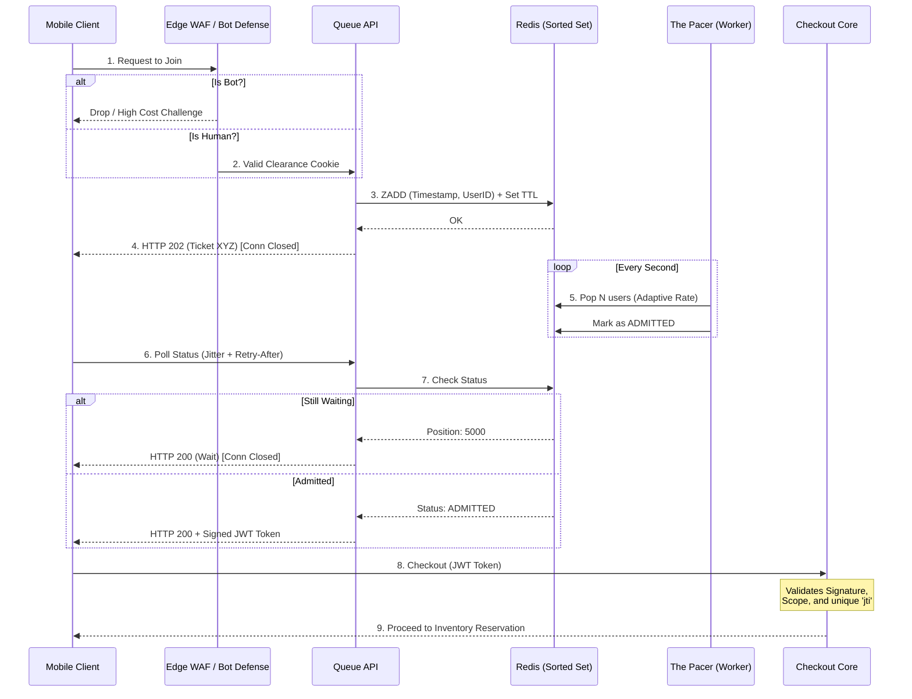

# 🧱 Engineering Brick: The Admission Control

> 🌸 *The outer gates repel the mindless swarm,*
> *The silent queue brings order to the storm.*

Welcome to Part 2 of the **Global Flash Sale Engine** series.

In [Part 1](), we built the perimeter defense. We shaped the initial storm of 1,000,000 requests so the obvious bots, duplicate retries, and excess machine traffic never reach the core.

But even after edge filtering, the system may still face a large pool of legitimate users — say 100,000 humans competing for a limited sale event. The transactional core cannot safely let all of them hit checkout at once. If the database can only sustain a controlled, adaptive slice of concurrent checkout attempts, the remaining users need somewhere to wait without holding expensive backend resources.

That gap — between legitimate demand at the edge and safe processing capacity in the core — is where the **Virtual Waiting Room** lives.

---

## 🌠 1) The Formal Specification (Problem Model)

The system must act as a shock absorber between the frantic user traffic and the delicate transactional database.

**The Interface**:
* `joinQueue(EventID, UserID)`: Enter the virtual waiting room.
* `pollStatus(QueueID)`: Check queue position.
* `checkout(AdmissionToken, Payload)`: The protected inner-core API.

**The Constraints**:
* **Connection Exhaustion**: We cannot hold tens or hundreds of thousands of waiting users on active connections that tie up expensive backend resources.
* **Fairness**: Provide an abuse-resistant admission policy, often FIFO-like within controlled windows.
* **Bot Mitigation**: Scalpers must face high costs *before* they consume queue slots.
* **Flow Control**: The queue must release users into the core *at or below* the rate the transactional path can safely process.

### 📊 The Admission Funnel

*For the rest of this article, treat the numbers as an illustrative capacity model:*

| Layer | Example Scale | Purpose |
| :--- | :--- | :--- |
| **Incoming Storm** | 1,000,000 requests | Raw traffic: humans, bots, retries, duplicate clicks. |
| **Eligible Users** | 100,000 users | Passed edge filtering and allowed to enter the waiting room. |
| **Released Batch** | Adaptive N/sec | Users granted admission tokens based on core health. |
| **Transactional Core** | Safe Capacity | Inventory reservation and checkout path. |

---

## 🛡️ 2) Design Principle 1: Edge Bot Defense

In a flash sale, the most dangerous traffic is not organic; it is scalper bots. If bots fill up your virtual waiting room, legitimate customers are locked out, destroying the business ROI.

We do not want to waste our core backend CPU evaluating whether a request is a bot. We push this to the **Edge (CDN / WAF)**.

Before a user is allowed to call `joinQueue`, the Edge layer intercepts the request.
* The edge may use proof-of-work (PoW), invisible CAPTCHA, WAF heuristics, device fingerprinting, account reputation, and behavioral scoring.
* These mechanisms raise the cost of automated traffic; they do not eliminate bots completely, but they force them to spend expensive CPU cycles or proxy costs.
* Successful clients receive an encrypted `Clearance Cookie`, which the API Gateway can verify cheaply without calling the core backend.

---

## 🚧 3) Design Principle 2: The Asynchronous TCP Trap

A fatal mistake in building a waiting room at flash-sale scale is not necessarily using WebSockets, but **tying every waiting user to an expensive backend resource**. If you hold tens or hundreds of thousands of active HTTP/WebSocket connections while users wait for 5 minutes, you will hit file descriptor (`ulimit`) limits on your gateways and starve application threads.

**The Solution: Asynchronous Polling with Jitter**
The waiting room must be stateless at the network layer.

1. **Join**: User calls `POST /queue`. The API instantly registers the user in a Redis Sorted Set (`ZADD queue:event_id <timestamp> <user_id>`) and returns `HTTP 202 Accepted` with a `QueueTicket`. The TCP connection is immediately closed. *Queue tickets must have strict TTLs to prevent abandoned clients from occupying admission capacity forever.*
2. **Poll**: The client app polls `GET /queue/status?ticket=XYZ`. Crucially, it does not poll blindly. It polls at a controlled interval with **jitter** (randomized offset), guided by a server-provided `retry_after` header.
3. **Check**: The backend queries Redis (`ZRANK`) to find the user's position. *(Note: At very large scale, a single global sorted set becomes a hot key. The waiting room must be partitioned or sharded by EventID or Region).* It returns `HTTP 200 OK`, and the connection is instantly closed again.

---

## 🏛️ 4) Design Principle 3: The Cryptographic Admission Token

The queue does not manage inventory. Its only job is to dictate the **Flow Rate**.

A background worker (The Pacer) continuously monitors the health of the primary database. The Pacer does not use a hard-coded number; it **adjusts the release rate dynamically** based on database latency, error rate, queue depth, and checkout success rate. It pulls the allowed number of users from Redis and updates their status to `ADMITTED`.

When an admitted user polls the status endpoint, the backend generates an **Admission Token** (a cryptographically signed JWT).

**The Golden Rule of the Inner Core:**
The core database does not trust a client claiming "I was admitted." It only trusts the cryptographic proof.
* The token must be **short-lived** (e.g., 3 minutes).
* It must be strictly **scoped** to `EventID + ProductID + UserID`.
* It must include a unique JWT ID (`jti`) and be **consumed once** at checkout to prevent replay attacks.
* If a request lacks a valid token, or attempts to reuse one? `HTTP 403 Forbidden`. *Nobody bypasses the waiting room.*

---

### 🗺️ The Architecture Flow Diagram

---

## ⚗️ 5) The Architect’s Crucible: Fairness Is Not Perfect FIFO

Strict First-In-First-Out (FIFO) is easy to explain but operationally brittle under distributed network chaos.

* Bots easily exploit deterministic queues.
* Global clock skew and network jitter mean the exact arrival millisecond of a packet is largely arbitrary.

Real systems often combine waiting rooms with **randomized lottery windows**. For example, everyone who joins in the first 30 seconds is placed into a "pre-queue" and randomized, while anyone joining after is placed in standard FIFO.

The architectural goal is not perfect chronological fairness; the goal is **abuse-resistant, explainable admission** that protects the core infrastructure.

---

## ⚡ 6) The Design Dialogue (Socratic Review)

*A true Architect must defend their design against operational reality. Let's stress-test the model.*

> **🕵️ The Challenger**: What if all clients poll the status endpoint at the exact same time and create a "secondary" thundering herd?

**🧑‍💻 The Architect**:
This is exactly why we never let clients poll blindly. The server returns a `retry_after` value combined with client-side **jitter** (randomized intervals). This smears the polling traffic evenly across time. Furthermore, the status endpoint can be lightly cached for a few seconds using a **ticket-scoped cache key**, or handled by a lightweight separate queue service—never the transactional core.

> **🕵️ The Challenger**: What prevents a tech-savvy user from copying the JWT Admission Token and opening 10 checkout sessions, or sharing it with friends?

**🧑‍💻 The Architect**:
This is why the token design is critical. First, the token is cryptographically bound to the `UserID` and risk/device signals. Second, to prevent the *same* user from spamming the core with replays, the token contains a `jti` (JWT ID). The checkout middleware records this `jti` in a fast-write store (such as Redis, DynamoDB, or another low-latency KV store with TTL) upon first use. Any subsequent request with the same token is instantly rejected as a replay attack.

> **🕵️ The Challenger**: What if the Redis cluster holding the queue state crashes during the flash sale?

**🧑‍💻 The Architect**:
Queue state is operational state, not financial state. We replicate it and may checkpoint it. However, if a total cluster loss occurs, the system must **fail closed**. We stop admissions, protect the core database, and restart the admission window with clear UI messaging (e.g., "Queue interrupted, re-establishing line"). We never fail open and let the herd stampede the database.

---

### 🗝️ The "Brick" Summary (Mental Model)

* **🌠 Signal**: Legitimate traffic volume exceeds the physical connection limits and throughput capacity of the transactional database.
* **🧩 Structure**: Edge Bot Defense + Async Polling (with Jitter) + One-Time Admission Tokens (JWT).
* **🏛️ Invariant**: The database must operate at a safe, adaptive capacity. Nobody bypasses the admission policy, and tokens cannot be replayed.
* **💠 Pivot Insight**: Decouple the queue from the inventory. Queueing means holding state. Hold that state asynchronously, prevent secondary herds with jitter, and pass cryptographic proof to the core.

---

🪷 *One sentence to trigger the reflex*: **"The waiting room is not the place where rejected traffic goes; it is the buffer between eligible demand and safe core capacity."**

> **Next up**: We have safely escorted an adaptive batch of users into the core, armed with cryptographic proof. Now they all want the exact same item. How do we deduct the stock without double-selling (oversell) and without causing a database deadlock? In [Part 3](), we tackle the hardest problem in e-commerce: **Distributed Inventory & Data Contention.**
