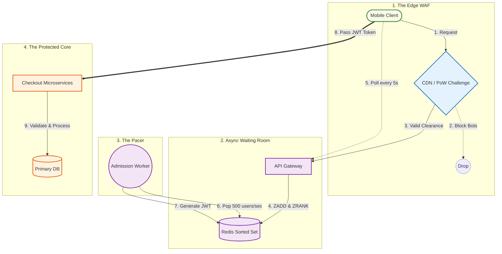

# 🧱 Engineering Brick: The Admission Control

> 🌸 *The outer gates repel the mindless swarm,*
> *The silent queue brings order to the storm.*

Welcome to Part 2 of the **Global Flash Sale Engine** series.

In [Part 1](), we built the Perimeter Defense. We aggressively dropped 99% of the traffic at the API Gateway using the Token Bucket algorithm. But what do we do with the 1% (still tens of thousands of users) that we *want* to let in?

A common fallacy among engineers is the belief that if you optimize your database queries (Latency), your system can handle infinite traffic (Throughput). This is mathematically false. When 50,000 users hit your Checkout API simultaneously, they will exhaust the Max Connections pool of your relational database in milliseconds. The CPUs will thrash due to context switching, and the throughput will plummet to zero.

To survive, we must completely decouple the **Queue State** from the **Inventory State**. Today, we architect the **Virtual Waiting Room**.

---

## 🌠 1) The Formal Specification (Problem Model)
The system must act as a shock absorber between the frantic user traffic and the delicate transactional database.

**The Interface**:
* `joinQueue(EventID, UserID)`: Enter the virtual waiting room.
* `pollStatus(QueueID)`: Check queue position.
* `checkout(AdmissionToken, Payload)`: The protected inner-core API.

**The Constraints**:
* **Connection Exhaustion**: We cannot hold 50,000 active TCP/WebSocket connections open on our Load Balancers.
* **Fairness**: Strict First-In-First-Out (FIFO) ordering for legitimate humans.
* **Bot Mitigation**: Scalpers must be blocked *before* they consume queue slots.
* **Flow Control**: The queue must release users into the core exactly at the rate the database can comfortably process (e.g., 500 TPS).

---

## 🛡️ 2) Design Principle 1: Edge Proof-of-Work (Bot Mitigation)
In a flash sale, the most dangerous traffic is not organic; it is scalper bots. If bots fill up your Virtual Waiting Room, legitimate customers are locked out, destroying the business ROI.

We do not want to waste our core backend CPU evaluating whether a request is a bot. We push this to the **Edge (CDN / WAF)**.

Before a user is allowed to call `joinQueue`, the Edge layer intercepts the request and injects a **Proof-of-Work (PoW)** challenge or an invisible CAPTCHA. 
* The user's browser must solve a cryptographic puzzle (taking ~500ms of client CPU).
* Bots running parallel curl scripts will refuse to spend CPU cycles solving thousands of puzzles, causing them to drop off.
* Successful clients receive an encrypted `Clearance Cookie`, which the API Gateway verifies in $O(1)$ time.

---

## 🔄 3) Design Principle 2: The Asynchronous TCP Trap
The most fatal mistake in building a Waiting Room is using **Synchronous Connections** (WebSockets or Long-Polling). 

If you hold 100,000 HTTP connections open while users wait for 5 minutes, you will hit the file descriptor (`ulimit`) limits on your API Gateways and Load Balancers. The infrastructure will crash before the database even does.

**The Solution: Asynchronous Polling**
The Waiting Room must be stateless at the network layer.

1. **Join**: User calls `POST /queue`. The API instantly registers the user in a Redis Sorted Set (`ZADD queue:event_id <timestamp> <user_id>`) and returns `HTTP 202 Accepted` with a `QueueTicket`. The TCP connection is immediately closed.
2. **Poll**: The client app blindly polls `GET /queue/status?ticket=XYZ` every 5 to 10 seconds.
3. **Check**: The backend queries Redis (`ZRANK`) to find the user's position and calculates the estimated wait time. It returns `HTTP 200 OK`. Again, the connection is instantly closed.

We trade a slight UX delay for absolute infrastructure invincibility.

---

## 🎟️ 4) Design Principle 3: The Admission Token (JWT)
The Queue does not manage inventory. Its only job is to dictate the **Flow Rate**.

A background worker (The Pacer) continuously monitors the health of the primary Database. If the DB can handle 500 Transactions Per Second (TPS), the Pacer pulls the top 500 users from the Redis Sorted Set every second and updates their status to `ADMITTED`.

When an admitted user polls the status endpoint, the backend generates an **Admission Token** (a short-lived, cryptographically signed JWT).

**The Golden Rule of the Inner Core:**
Every API in the transactional core (Inventory, Payment, Checkout) sits behind a strict Middleware. 
* If a request lacks a valid JWT Admission Token? `HTTP 403 Forbidden`. 
* If the token is expired? `HTTP 401 Unauthorized`.
* *Nobody bypasses the Waiting Room.*

### The Admission Control Architecture

---

## ⚡ 5) The Design Dialogue (Socratic Review)

*A true Architect must defend their design against operational reality. Let's stress-test the model.*

> **🕵️ The Challenger**: If we are just queueing users, why not use a standard Message Broker like RabbitMQ or Kafka instead of Redis?

**🧑‍💻 The Architect**:
Because we are queueing *HTTP Clients (Users)*, not *Backend Microservices*. Kafka is designed for sequential log consumption by a few predictable backend consumers. We need to answer the question: *"What is my exact position in line?"* for 100,000 random clients simultaneously. Redis Sorted Sets (`ZRANK`) provide $O(\log N)$ random-access lookups for queue positions, which Kafka cannot do natively.

> **🕵️ The Challenger**: What prevents a tech-savvy user from getting an Admission Token, duplicating it, and sharing it with 10 of their friends to bypass the waiting room?

**🧑‍💻 The Architect**:
A JWT is just a signed payload; it can be copied. To prevent token sharing, we must bind the token to the user's identity. The JWT payload includes the `UserID` or a `DeviceFingerprint`. When the inner core receives the JWT, it verifies that the `UserID` in the token matches the `UserID` of the authenticated session making the checkout request. If they mismatch, the request is dropped.

> **🕵️ The Challenger**: What if the Redis cluster holding the Queue State crashes during the flash sale?

**🧑‍💻 The Architect**:
In a flash sale, the Queue State is **ephemeral**. If Redis crashes, we lose the line order. While tragic for UX, it is *not* a financial failure (like losing a payment). We rely on Redis Cluster replication for high availability. If total failure occurs, the fallback strategy is to instantly return `HTTP 503 Service Unavailable` with a "Please refresh" UI, effectively restarting the queue. The absolute invariant is that the **SQL Database remains protected**.

---

### 🗝 The "Brick" Summary (Mental Model)

* **🌠 Signal**: Legitimate traffic volume exceeds the physical connection limits and throughput capacity of the transactional database.
* **🧩 Structure**: Edge PoW (WAF) + Async Polling (Redis Sorted Sets) + JWT Admission Tokens.
* **🏛 Invariant**: The Database must operate at a constant, safe capacity regardless of external network bursts. Nobody bypasses the token gateway.
* **💠 Pivot Insight**: Decouple the Queue from the Inventory. Queueing means holding state. If you hold that state in active TCP connections or SQL row locks, you will crash. Hold the queue state in Async Redis, and only pass mathematical tokens to the core.

---

🪷 *One sentence to trigger the reflex*: **"Queries optimize the latency, but admission control governs the throughput; to protect the core, we must dictate the flow."**

> **Next up**: We have safely escorted exactly 500 users per second into the core. Now they all want the exact same item. How do we deduct the stock without double-selling (Oversell) and without causing a Database Deadlock? In [Part 3](), we tackle the hardest problem in e-commerce: **Distributed Inventory & Data Contention.**
