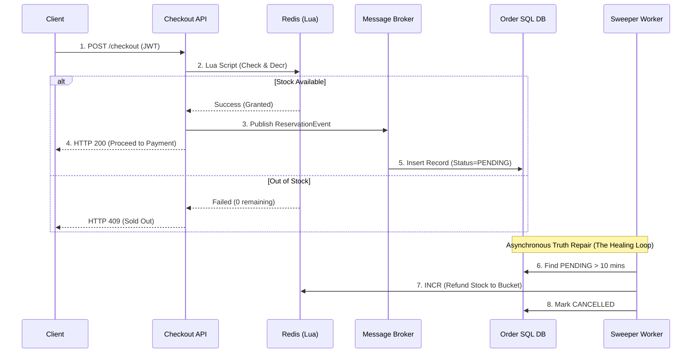

# 🧱 Engineering Brick: Distributed Inventory

> 🌸 *The outer gates have filtered out the storm,*
> *But at the vault, a deadly queue will form.*

Welcome to Part 3 of the **Global Flash Sale Engine** series.

Let us trace the funnel so far: In [Part 1](), our Edge WAF absorbed the raw storm of 1,000,000 requests. In [Part 2](), the Virtual Waiting Room buffered the 100,000 eligible humans, gradually releasing an adaptive batch into the core. 

Now, assume a hot window where **10,000 valid token holders** hit the `Checkout` API simultaneously. They are all competing for exactly **1,000 units** of the same SKU (e.g., the new iPhone).

If you let all 10,000 checkout requests directly update the relational database, you will trigger the deadliest trap in e-commerce architecture: **The Hot-Row Problem**. Today, we architect the Distributed Inventory system.

---

## 🌠 1) The Formal Specification (Problem Model)

The inventory subsystem must reliably deduct stock under extreme concurrent access.

**The Interface**:
* `reserveInventory(SkuID, UserID, Token)`: Attempt to secure one unit of stock.

**The Constraints**:
* **Strict Correctness**: Zero tolerance for overselling. You cannot sell 1,001 items if you only have 1,000.
* **Avoid Hot-Row Contention**: A single SQL row must not become the serialization point for every purchase attempt.
* **Eventual Consistency**: Fast memory state (reservation) and durable SQL state (order ledger) may diverge momentarily but must eventually reconcile.

---

## 🚧 2) Design Principle 1: The Hot Row Is The Enemy

The naive approach to inventory management is relying entirely on the ACID properties of a relational database (like PostgreSQL or MySQL). A junior engineer might write:

```sql
UPDATE inventory 
SET available = available - 1 
WHERE sku_id = 'IPHONE_15' AND available > 0;

```

At a normal scale, this conditional update is perfectly correct. But in a flash sale, it is a catastrophic **Serialization Bottleneck**.

When 10,000 threads execute this query at the same millisecond, the database engine must place an exclusive row-level lock on the `IPHONE_15` row.

* Thread 1 acquires the lock. Threads 2 to 10,000 wait.
* Thread 1 finishes. Thread 2 acquires the lock. Threads 3 to 10,000 wait.

This extreme contention causes transaction timeouts, connection pool exhaustion, and CPU spikes. The database spends all its energy managing locks rather than writing data. Throughput collapses, and the system experiences a cascading failure.

---

## ⚡ 3) Design Principle 2: Atomic In-Memory Reservation

To survive, we must move the point of contention out of the disk-backed SQL row and into blazing-fast Memory. We use **Redis** as our Fast Reservation Gate.

However, fetching the stock to the application layer, deducting it in Java/Go, and writing it back to Redis creates a classic Race Condition. To solve this without using slow Distributed Locks, we use **Redis Lua Scripts**.

Because Redis executes commands in a strictly single-threaded event loop, a Lua script is naturally **Atomic**.

```lua
-- Conceptual Lua Script for Atomic Decrement
local stock = tonumber(redis.call('GET', KEYS[1]))
if stock and stock > 0 then
    redis.call('DECR', KEYS[1])
    return 1 -- Success
else
    return 0 -- Sold Out
end

```

By pushing the check-and-decrement logic directly into the Redis engine, we ensure absolute atomicity. It prevents overselling at the outer layer with microsecond latency, completely shielding the SQL database from the storm.

---

## 🪓 4) Design Principle 3: Inventory Sharding

At a massive scale (e.g., Alibaba's Singles' Day), even a single Redis node has a physical throughput limit. If 100,000 requests hit the exact same Redis Key simultaneously, it becomes a **Hot Key**, saturating the CPU and network interface of that specific Redis instance.

To bypass the physical limits of a single core, we implement **Inventory Sharding**.
Instead of storing `{ "IPHONE_15": 1000 }` in one key, we split the stock across 10 different buckets (shards), perhaps spread across multiple Redis nodes:

* `IPHONE_15:bucket_1` = 100
* `IPHONE_15:bucket_2` = 100
  ...
* `IPHONE_15:bucket_10` = 100

When a user requests an item, the API Gateway hashes the `UserID` to route them to a specific bucket. This reduces contention by a factor of 10.

*(Note: Sharding introduces "Imbalance"—Bucket 1 might sell out while Bucket 2 still has stock. The application layer must handle this by implementing Local Retries to seamlessly steal from another bucket if the primary one is empty).*

---

## ⚖️ 5) Design Principle 4: Two-Phase Reservation & Reconciliation

Memory is volatile. Redis is the fast battlefield, but SQL is the durable book of record.
What happens if a user successfully reserves an item in Redis, but their credit card is declined, or they abandon the checkout? If we don't return the item, we suffer from **Phantom Stock** (inventory locked forever).

We solve this using a **Two-Phase Reservation and a Reconciliation Loop**.

1. **Reserve (Soft Lock)**: Redis deducts the stock and grants a temporary `ReservationToken` with a strict Time-To-Live (TTL, e.g., 10 minutes).
2. **Emit**: The API synchronously publishes a durable `ReservationEvent` to a Message Broker (Kafka/RabbitMQ).
3. **Persist**: A consumer writes a `PENDING` order into the SQL Database.
4. **Commit**: If payment succeeds within 10 minutes, the order is marked `COMMITTED`.

### The Asynchronous Healing Loop (The Sweeper)

If the user abandons the cart, the TTL expires. A background worker (The Sweeper) continuously scans the SQL database for `PENDING` reservations older than 10 minutes. It marks them as `CANCELLED` and safely increments (returns) the stock back to the Redis bucket.

### 🗺️ The Inventory Reconciliation Architecture



---

## ⚡ 6) The Design Dialogue (Socratic Review)

*A true Architect must defend their design against operational reality. Let's stress-test the model.*

> **🕵️ The Challenger**: Why use Redis Lua scripts instead of a standard Distributed Lock (like Redlock) to ensure no overselling?

**🧑‍💻 The Architect**:
Distributed locks kill throughput. A lock forces threads to wait across the network, turning concurrent operations into sequential ones. Inventory decrementing is fundamentally an Atomic Counter operation, not a complex state mutation. Using a lock to decrement a counter is architectural overkill. Lua scripts execute sequentially inside Redis instantly, providing atomicity without the heavy overhead of holding locks.

> **🕵️ The Challenger**: You mentioned Inventory Sharding. What if Shard A runs out of stock, but Shard B still has 50 units? Does the user assigned to Shard A just fail?

**🧑‍💻 The Architect**:
No. The API layer handles this via **Local Retries (Shard Stealing)**. If a user hashes to Shard A and receives a "Sold Out" response, the application transparently retries the request on Shard B (e.g., using a round-robin fallback) before giving up. The cost of a few extra Redis calls is trivial compared to the benefit of massive parallel throughput.

> **🕵️ The Challenger**: What if Redis crashes entirely right after deducting the stock, but before the API can publish the `ReservationEvent` to Kafka?

**🧑‍💻 The Architect**:
This is where we must distinguish between the Fast Gate and the Ledger. Redis is not the final book of record. If Redis crashes and loses state, it is simply restored from its Append-Only File (AOF). Any discrepancy between Redis (what it thinks is reserved) and SQL (the actual durable orders) is aggressively corrected by the **Reconciliation Worker**, which audits the database and repairs the Redis counter. We rely on the Database for truth, and Reconciliation for healing.

---

### 🗝️ The "Brick" Summary (Mental Model)

* **🌠 Signal**: Thousands of concurrent writes target a single inventory metric.
* **🧩 Structure**: Atomic Lua Scripts + Inventory Sharding + 2-Phase Reservation + Reconciliation Sweeper.
* **🏛️ Invariant**: The database must not act as the serialization queue. Reservations must have strict TTLs to prevent phantom stock.
* **💠 Pivot Insight**: Do not make the SQL row absorb the storm. Let memory handle short-lived reservations, let durable storage record the committed truth, and let reconciliation heal the gap between them.

---

🪷 *One sentence to trigger the reflex*: **"Redis is the fast battlefield. SQL is the durable book of record. Reconciliation is the healing loop."**

> **Next up**: We have secured the inventory and protected the database. Now, the user takes out their credit card. How do we ensure they are never charged twice, even if they hit "Pay" 50 times during a network outage? In the final [Part 4], we integrate the core concepts of our previous Payment Gateway series to close the loop on the **Global Flash Sale Engine**.
