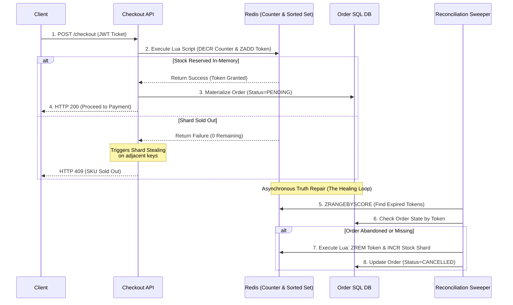

# 🧱 Engineering Brick: The Hot-Row Escape

> 🌸 *The outer gates have filtered out the storm,*
> *But at the vault, a deadly queue will form.*

Welcome to Part 3 of the **Global Flash Sale Engine** series.

Let us trace the funnel built so far: In [Part 1](), our Edge WAF absorbed and shaped the raw storm of 1,000,000 requests. In [Part 2](), the Virtual Waiting Room buffered the 100,000 eligible humans, gradually releasing them into the core backend via an adaptive pace.

Now, assume a hot window where **10,000 valid token holders** hit the `Checkout` API simultaneously. They are all competing for exactly **1,000 units** of a highly anticipated, limited-availability SKU.

If you let all 10,000 checkout requests directly hit and update your relational database, you will trigger the most destructive trap in e-commerce infrastructure: **The Hot-Row Problem**. Today, we architect a bounded-consistency inventory engine designed for bulletproof correctness under extreme contention.

---

## 🌠 1) The Formal Specification (Problem Model)

The inventory subsystem must reliably deduct stock under high-concurrency conditions without blocking application threads or locking the storage layer.

**The Interface**:
* `reserveInventory(SkuID, UserID, Token)`: Attempt to secure a temporary reservation for one unit of stock.

**The Constraints**:
* **Strict Correctness**: Zero tolerance for overselling. Selling 1,001 items when only 1,000 exist is a fatal system failure.
* **Avoid Hot-Row Contention**: A single SQL database row must never become the global serialization queue for concurrent transactions.
* **Divergence Tolerance**: Fast in-memory state and durable storage ledgers are allowed to diverge momentarily, provided there is a deterministic, automated repair path.

---

## 🚧 2) Design Principle 1: The Hot Row Is the Enemy

The traditional approach to inventory management relies on the implicit row-level locking of relational databases (ACID transactions). A standard implementation uses a conditional update:

```sql
UPDATE inventory 
SET available = available - 1 
WHERE sku_id = 'IPHONE_16_PRO' AND available > 0;

```

While this block is perfectly correct at normal scale, under flash-sale conditions it becomes a catastrophic **Serialization Bottleneck**.

When 10,000 transactions execute this query concurrently, the database engine must place an exclusive row-level lock on the single row representing `IPHONE_16_PRO`.

* Transaction 1 acquires the lock. Transactions 2 to 10,000 block and queue up inside the database engine.
* Transaction 1 commits and releases the lock. Transaction 2 acquires it. Transactions 3 to 10,000 continue to wait.

This intense lock contention causes transaction timeouts, quickly exhausts the database connection pool, spikes the CPU due to context switching, and causes effective throughput to collapse to zero. The hot row becomes a single point of congestion that cripples the entire platform.

---

## 💎 3) Design Principle 2: Reservation Is Not Commitment

To survive extreme burst traffic, a Staff/Principal Architect must decouple **Reservation** (securing a temporary right to buy) from **Commitment** (the final, irreversible financial and order capture).

In high-concurrency inventory design, we operate under a core business philosophy:

> **"In flash-sale inventory, underselling is a business inefficiency; overselling is a correctness failure."**

If a system accidentally accepts 995 checkouts instead of 1,000 because a few network requests timed out, the remaining 5 items can easily be sold seconds later via automated cron jobs. But if the system accepts 1,005 checkouts for 1,000 items, it breaks data consistency, forcing expensive operations, support overhead, and customer dissatisfaction.

Therefore, we treat the fast memory layer purely as a **Reservation Accelerator**. It handles the immediate burst of demand, screens out excess candidates, and passes clean, cryptographically proven results down to the durable system of record.

---

## ⚡ 4) Design Principle 3: The Atomic Reservation Gate

Moving inventory state to **Redis** allows us to handle high write volumes at microsecond speeds. However, a common engineering pitfall is to execute a simple decrement (`DECR`) and then rely on the application backend to publish an event or write to the database.

If the application container suffers an Out-Of-Memory (OOM) crash or network partition immediately after the Redis decrement but before publishing the event, a critical state mismatch occurs: the Redis counter is permanently lowered, but no order record is ever created. The stock simply vanishes into a permanent **Phantom Stock** state.

To eliminate this dual-write vulnerability, the reservation gate must perform the decrement and record the reservation state **atomically within the same execution context**. We achieve this using **Redis Lua Scripts**.

Because Redis executes scripts sequentially within its single-threaded event loop, the entire Lua block is guaranteed to be atomic within the shard executing it.

```lua
-- Atomic Check, Decrement, and State Storage
local stock_key = KEYS[1]
local index_key = KEYS[2]
local token = ARGV[1]
local expiry = tonumber(ARGV[2])

local current_stock = tonumber(redis.call('GET', stock_key))

if current_stock and current_stock > 0 then
    -- 1. Deduct the counter
    redis.call('DECR', stock_key)
    -- 2. Create the reservation state with an exact expiration timestamp
    redis.call('ZADD', index_key, expiry, token)
    return 1 -- Success
else
    return 0 -- Sold Out
end

```

By binding the inventory decrement directly to a tracked, time-bounded `ReservationToken` inside Redis, we guarantee that every unit deducted is attached to an identifiable lifecycle. If the application server crashes right after this script executes, the reservation state remains safely anchored within Redis, ready for automated recovery.

---

## 🪓 5) Design Principle 4: Shard for Throughput, Reconcile for Truth

Even when using Redis, if 10,000 requests hit the exact same inventory key simultaneously, that key becomes a **Hot Key**, saturating the CPU and network capacity of that single Redis node.

To unlock massive horizontal scale, we implement **Inventory Sharding**.
Instead of storing all 1,000 units of stock under a single global key, we partition the stock into $N$ distinct buckets (shards) distributed across the Redis cluster:

* `SKU_1001:shard_1` = 100
* `SKU_1001:shard_2` = 100
* ...
* `SKU_1001:shard_10` = 100

When an incoming request arrives, the checkout service hashes the `UserID` to map the user to a specific inventory shard. This spreads the concurrent write load evenly across multiple CPU cores and memory segments.

### Handling Shard Imbalance via Shard Stealing

Sharding introduces the risk of imbalance: Shard 1 might sell out due to a cluster of user hashes, while Shard 2 still has 40 units remaining. To maintain fairness, if a user hits their designated shard and receives a "Sold Out" signal, the application layer initiates a **Local Retry (Shard Stealing)** policy. The request transparently checks adjacent shards on the hashing ring before returning a definitive out-of-stock response to the client.

---

## 🔄 6) Design Principle 5: Failure Is a State, Not an Exception

In a high-throughput architecture, crashes, timeouts, and abandoned carts are modeled directly as valid states within a deterministic **Inventory Lifecycle**. We govern this entire process through an asynchronous, two-phase coordination pattern.

1. **Phase 1 (Reserve)**: The Redis Lua script secures the stock, returns a token, and tracks it inside a Redis Sorted Set with an expiration timestamp ($T + 10 \text{ minutes}$).
2. **Phase 2 (Materialize)**: The application server attempts to write a `PENDING` order record directly into the SQL database.
3. **Phase 3 (Commit)**: If the user completes payment within the 10-minute window, the SQL order transitions to `COMMITTED`, locking in the sale permanently.

### The Asynchronous Healing Loop (The Sweeper)

If a user abandons their checkout or the application server crashes during the materialization phase, the reservation naturally expires. A background worker—**The Reconciliation Sweeper**—handles automatic truth repair through an event-driven delayed loop or a lightweight index scan.

Instead of running heavy, lock-inducing `SELECT` scans over the primary SQL database, the Sweeper queries the Redis Sorted Set using `ZRANGEBYSCORE` to find reservation tokens whose expiration timestamps are less than `NOW()`. For every expired token found, the Sweeper cross-references the SQL database:

* If the order does not exist or remains unconfirmed, it means the checkout failed or was abandoned. The Sweeper executes a Lua script to remove the token from the index and safely increment (refund) the stock back to the appropriate Redis shard.
* If the order is already marked `COMMITTED`, the Sweeper simply removes the expired token from Redis, as the truth is now securely recorded in the SQL ledger.

### 🗺️ The Inventory Reservation Lifecycle



---

## ⚡ 7) The Design Dialogue (Socratic Review)

*A true Architect must defend their design against operational reality. Let's stress-test the lifecycle.*

> **🕵️ The Challenger**: Why go through the complexity of Redis Lua scripts and sharding instead of just using a standard Distributed Lock implementation like Redlock?

**🧑‍💻 The Architect**:
Distributed locks severely degrade throughput. A distributed lock forces concurrent threads to wait across network boundaries, effectively turning highly parallel operations into a single-threaded execution queue. Inventory deduction is fundamentally an atomic math operation, not a complex state machine mutation. Using a distributed lock to decrement a number is an anti-pattern at this scale. Our Lua script executes sequentially inside the Redis engine instantly, providing microsecond atomicity without any lock-holding overhead.

> **🕵️ The Challenger**: What happens if Redis crashes entirely right after executing the Lua script, losing the reservation sorted set before the SQL database can materialize the order?

**🧑‍💻 The Architect**:
We explicitly do not treat Redis as the final source of truth. Redis is an admission accelerator used to absorb burst contention. If a total Redis cluster failure occurs, we recover its state using standard Append-Only Files (AOF) or replica failover where possible.

More importantly, any absolute divergence between the reservation gate and the durable database is caught and repaired by the reconciliation loop. If Redis loses its reservation tokens, the Reconciliation Worker audits the database state against warehouse realities and reinstates or cancels active allocations. We rely on the database for durability, and reconciliation for healing.

---

## 🗝️ 8) The "Brick" Summary (Mental Model)

* **🌠 Signal**: High-volume, concurrent write requests targeting a single database row, resulting in thread pool starvation and transaction timeouts.
* **🧩 Structure**: Bounded-Consistency Architecture + Atomic Lua Reservations + Inventory Sharding + Asynchronous Reconciliation Sweepers.
* **🏛️ Invariant**: The database must never act as the hot serialization queue. Every in-memory stock reduction must be bound to a time-limited token within an atomic operation.
* **💠 Pivot Insight**: Do not make the SQL row absorb the storm. Let memory handle short-lived reservations, let durable storage record committed truth, and let reconciliation heal the gap between them.

---

🪷 *One sentence to trigger the reflex*: **"Redis is the fast battlefield. SQL is the durable book of record. Reconciliation is the healing loop."**

> **Next up**: The inventory is safely reserved, and the core database remains completely insulated from the hot-row storm. Now, the user takes out their credit card to finalise the transaction. How do we guarantee they are never charged twice, even if they hit the "Pay" button 50 times during an active network partition? In the final **Part 4**, we integrate our core payment gateway patterns to close the loop on the **Global Flash Sale Engine**.

