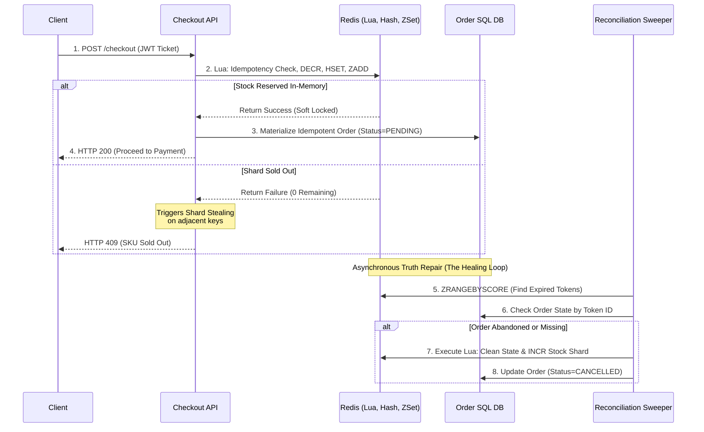

# 🧱 Engineering Brick: The Hot-Row Escape

> 🌸 *The outer gates have filtered out the storm,*
> *But at the vault, a deadly queue will form.*

Welcome to Part 3 of the **Global Flash Sale Engine** series.

Let us trace the funnel built so far: In [Part 1](), our Edge WAF absorbed and shaped the raw storm of 1,000,000 requests. In [Part 2](), the Virtual Waiting Room buffered the 100,000 eligible humans, gradually releasing them toward the transactional core via an adaptive pace.

Now, assume a hot window where **10,000 valid token holders** hit the `Checkout` API simultaneously. They are all competing for exactly **1,000 units** of a highly anticipated, limited-availability SKU.

If you let all 10,000 checkout requests directly hit and update your relational database, you will trigger the most destructive trap in e-commerce infrastructure: **The Hot-Row Problem**. Today, we architect a bounded-consistency inventory engine designed to preserve correctness under extreme contention.

---

## 🌠 Formal Specification: Problem Model

The inventory subsystem must reliably deduct stock under high-concurrency conditions without blocking application threads or locking the storage layer.

**The Interface**:
* `reserveInventory(SkuID, UserID, Token)`: Attempt to secure a temporary reservation for one unit of stock.

**The Constraints**:
* **Strict Correctness**: Zero tolerance for overselling. Selling 1,001 items when only 1,000 exist is a fatal system failure.
* **Avoid Hot-Row Contention**: A single SQL database row must never become the global serialization queue for concurrent transactions.
* **Divergence Tolerance**: Fast in-memory state and durable storage ledgers are allowed to diverge momentarily, provided there is a deterministic, automated repair path.

---

## 🔍 Context & Symptom: The Hot Row Is the Enemy

The traditional approach to inventory management relies on the implicit row-level locking of relational databases (ACID transactions). A standard implementation uses a conditional update:

```sql
UPDATE inventory 
SET available = available - 1 
WHERE sku_id = 'HOT_SKU' AND available > 0;

```

While this block is perfectly correct at normal scale, under flash-sale conditions it becomes a catastrophic **Serialization Bottleneck**.

When 10,000 transactions execute this query concurrently, the database engine must place an exclusive row-level lock on the single row representing 'HOT_SKU'.

* Transaction 1 acquires the lock. Transactions 2 to 10,000 block and queue up inside the database engine.
* Transaction 1 commits and releases the lock. Transaction 2 acquires it. Transactions 3 to 10,000 continue to wait.

This intense lock contention causes transaction timeouts, quickly exhausts the database connection pool, spikes the CPU due to context switching, and causes effective throughput to collapse to zero. The hot row becomes a single point of congestion that cripples the entire platform.

---

## 🏛️ Architectural Doctrine: Reservation Is Not Commitment

To survive extreme burst traffic, a system architect must decouple **Reservation** (securing a temporary right to buy) from **Commitment** (the final, irreversible financial and order capture).

In high-concurrency inventory design, we operate under a core business philosophy:

> **"In flash-sale inventory, underselling is a business inefficiency; overselling is a correctness failure."**

If a system accidentally accepts 995 checkouts instead of 1,000 because a few network requests timed out, the remaining 5 items can easily be sold seconds later via automated compensation jobs. But if the system accepts 1,005 checkouts for 1,000 items, it breaks data consistency, forcing expensive operations, support overhead, and customer dissatisfaction.

Therefore, we treat the fast memory layer purely as a **Reservation Accelerator**. It handles the immediate burst of demand, screens out excess candidates, and passes clean, cryptographically proven results down to the durable system of record.

---

## ⛩️ Integrity Boundary: The Atomic Reservation Gate

Moving inventory reservation to Redis allows us to handle high write volumes with very low latency. However, a common engineering pitfall is to execute a simple decrement (DECR) and then rely on the application backend to publish an event or write to the database.

If the application container crashes immediately after the Redis decrement but before creating the database order, the stock simply vanishes into a permanent Phantom Stock state.

To eliminate this dual-write vulnerability, the reservation gate must perform the decrement and record the complete reservation metadata **atomically within the same execution context**. We achieve this using **Redis Lua Scripts**. Because Redis executes scripts sequentially, the Lua block is guaranteed to be atomic within the Redis shard executing it.

```lua
-- 0. Idempotency guard: retrying the same reservation token must not double-decrement
if redis.call('EXISTS', res_key) == 1 then
    return 1 -- Already reserved for this token
end

local current_stock = tonumber(redis.call('GET', stock_key))

if current_stock and current_stock > 0 then
    -- 1. Deduct the counter
    redis.call('DECR', stock_key)

    -- 2. Store reservation metadata for the Sweeper to recover
    redis.call('HSET', res_key,
        'sku', ARGV[1],
        'user', ARGV[2],
        'shard', ARGV[3],
        'qty', 1,
        'status', 'RESERVED',
        'expiry', expiry
    )
    redis.call('EXPIRE', res_key, ARGV[4]) -- TTL slightly longer than expiry

    -- 3. Index the token by expiry for the Sweeper
    redis.call('ZADD', index_key, expiry, token)

    return 1 -- Success
else
    return 0 -- Sold Out
end

```

In production, the script stores not only the token in the expiry index (Sorted Set) but also a small reservation metadata record (Hash). The sorted set is the sweeper index; the reservation record is the recovery payload. This prevents phantom stock and ensures every deducted unit is attached to an identifiable lifecycle.

---

## 🧩 Architecture & Composition: Shard for Throughput

Even when using Redis, if 10,000 requests hit the exact same inventory key simultaneously, that key becomes a **Hot Key**, saturating the CPU of that single Redis node.

To unlock massive horizontal scale, we implement **Inventory Sharding**.
Instead of storing all 1,000 units of stock under a single global key, we partition the stock into N distinct buckets (shards) distributed across the Redis cluster (e.g., 10 shards x 100 units).

When an incoming request arrives, the checkout service hashes the UserID to map the user to a specific inventory shard.

**Handling Shard Imbalance via Shard Stealing:**
Sharding introduces the risk of imbalance: Shard 1 might sell out while Shard 2 still has 40 units remaining. To maintain fairness, if a user hits their designated shard and receives a "Sold Out" signal, the application layer initiates a **Local Retry (Shard Stealing)** policy. The request transparently checks adjacent shards on the hashing ring before returning a definitive out-of-stock response to the client.

---

## 🌀 Timeline & Lifecycle: Failure Is a State, Not an Exception

In a high-throughput architecture, crashes, timeouts, and abandoned carts are modeled directly as valid states within a deterministic **Inventory Lifecycle**.

1. **Phase 1 (Reserve)**: The Redis Lua script secures the stock, creates the metadata payload, and indexes it with an expiration timestamp.
2. **Phase 2 (Materialize)**: The application server writes an idempotent PENDING order record into the SQL database using the ReservationToken as a unique correlation key.
* *Architectural Note:* If the API crashes after the Redis reservation but before SQL materialization, the token still exists in Redis and will eventually expire. The Sweeper will observe that no durable order exists for that token and release the stock. This creates a temporary undersell window, not an oversell risk.


3. **Phase 3 (Commit)**: If the user completes payment before the expiry, the SQL order transitions to COMMITTED, locking in the sale.
4. **Phase 4 (Release & Reconcile)**: A background worker—The Reconciliation Sweeper—queries the Redis Sorted Set using ZRANGEBYSCORE to find tokens that have expired.
* It cross-references the metadata against the SQL database.
* If the order is abandoned or missing, the Sweeper removes the token and increments (refunds) the stock back to the Redis shard.
* If the order is COMMITTED, the Sweeper simply cleans up the Redis state, as the truth is now securely recorded in the SQL ledger.


### 🗺️ The Inventory Reservation Lifecycle



---

## ⚡ Socratic Review: Design Dialogue

*Let's stress-test the model against production chaos.*

> **🕵️ The Challenger**: Why go through the complexity of Redis Lua scripts and sharding instead of just using a standard Distributed Lock implementation like Redlock?

**🧑‍💻 The Architect**:
Distributed locks severely degrade throughput. A distributed lock forces concurrent threads to wait across network boundaries, effectively turning highly parallel operations into a single-threaded execution queue. Inventory deduction is fundamentally an atomic counter operation. Our Lua script executes sequentially inside the Redis engine, providing atomicity without any lock-holding network overhead.

> **🕵️ The Challenger**: What happens if Redis crashes entirely and loses all state?

**🧑‍💻 The Architect**:
If Redis loses reservation state completely, the system must fail closed: we stop new admissions for that SKU, rebuild the Redis counters from the durable source of record, and only then resume. The rebuild uses the initial sale allocation minus committed orders, and minus still-valid pending reservations that can be verified in SQL and the payment state. If a reservation cannot be proven, we prefer customer-safe compensation and temporary underselling over overselling. Redis is the fast gate, not the final book of record.

> **🕵️ The Challenger**: What if payment succeeds after the reservation token has already expired and the stock was released back to the pool?

**🧑‍💻 The Architect**:
The payment service must validate the reservation state before final capture. A reservation token is not just a UI permission; it is a strict contract with an expiry. Capture should be rejected before money movement whenever possible; if the Payment Service Provider (PSP) already accepted the charge, the system must void or refund through a compensating payment flow. This is why reservation expiry, payment idempotency, and order state transitions must share the same correlation ID. We strictly prefer a failed checkout or an automatic refund over overselling.

---

## 📊 Matrix & Metrics: Numbers & Assumptions

* **Incoming Storm**: 1,000,000 raw requests in the first second.
* **Eligible Users**: 100,000 users passed edge filtering and entered the waiting room.
* **Admitted Window**: 10,000 valid token holders released toward the transactional core.
* **Inventory Constraints**: 1,000 units strictly available.
* **Redis Sharding**: 10 shards x 100 units to distribute write throughput.
* **Business Rule**: Underselling is a temporary inefficiency; overselling is a fatal correctness failure.

---

## 🪞 Failure Mode: The Chaos Matrix

* **API Crashes After Lua Execution But Before SQL Materialization**: The token remains in Redis and will eventually expire. The Sweeper observes that no durable order exists for that token and releases the stock. This creates a temporary undersell window, not an oversell risk.
* **Payment Succeeds After Reservation Expiry**: Capture should be rejected before money movement; if already charged, void/refund via compensation flow.
* **Total Redis Cluster Loss**: Fail closed -> Stop admissions -> Rebuild counter from SQL (Initial Allocation - Committed Orders - Verified Pending Reservations).
* **Severe Shard Imbalance**: Bounded shard stealing is permitted (e.g., max 2 retries on adjacent shards), but we never retry indefinitely to avoid internal cascading thundering herds.

---

## ☯️ Production Realism: Trade-offs & Notes

* Redis is a fast reservation accelerator, not the final source of truth. Do not treat memory state as a financial ledger.
* The release Lua script in the Sweeper must check that the reservation is still in the RESERVED state before incrementing stock; otherwise, a committed or already-released token could be refunded twice.
* Reservation TTL should ideally include a business expiry window plus a small technical recovery grace period to allow asynchronous webhooks to arrive.

---

## 🗝️ Brick Summary: Mental Model

* **🌠 Signal**: High-volume, concurrent write requests targeting a single database row, resulting in transaction timeouts.
* **🧩 Structure**: Bounded-Consistency Architecture + Atomic Lua Reservations (State & Expiry) + Inventory Sharding + Reconciliation Sweepers.
* **🏛️ Invariant**: The database must never act as the hot serialization queue. Correctness is a lifecycle with bounded divergence, durable truth, and deterministic repair.
* **💠 Pivot Insight**: Do not make the SQL row absorb the storm. Let memory handle short-lived reservations, let durable storage record committed truth, and let reconciliation heal the gap between them.

---

🪷 *One sentence to trigger the reflex*: **"Redis is the fast battlefield. SQL is the durable book of record. Reconciliation is the healing loop."**

> **Next up**: The inventory is safely reserved, and the core database is no longer the hot serialization point. Now, the user takes out their credit card to finalise the transaction. How do we guarantee they are never charged twice, even if they hit the "Pay" button 50 times during an active network partition? In the final [Part 4], we integrate our core payment gateway patterns to close the loop on the **Global Flash Sale Engine**.
