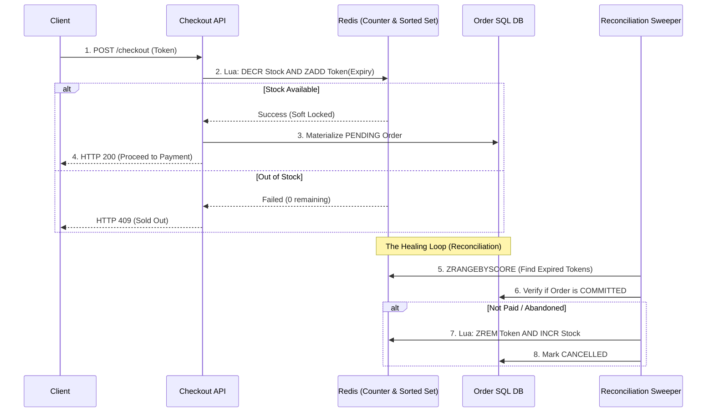

# 🧱 Engineering Brick: The Hot-Row Escape

> 🌸 *The outer gates have filtered out the storm,*
> *But at the vault, a deadly queue will form.*

Welcome to Part 3 of the **Global Flash Sale Engine** series.

Let us trace the funnel so far: In [Part 1](), our Edge WAF absorbed the raw storm of 1,000,000 requests. In [Part 2](), the Virtual Waiting Room buffered the 100,000 eligible humans, safely keeping them away from the core backend.

Now, assume the waiting room releases an adaptive batch of admitted users into the core. During a hot window, **10,000 valid token holders** may compete for exactly **1,000 units** of the same SKU (e.g., a flagship smartphone).

If you let all 10,000 checkout requests directly update the relational database, you will trigger the deadliest trap in e-commerce architecture: **The Hot-Row Problem**. Today, we architect the Distributed Inventory escape.

---

## 🌠 1) The Formal Specification (Problem Model)

The inventory subsystem must reliably deduct stock under extreme concurrent access without halting the application.

**The Interface**:
* `reserveInventory(SkuID, UserID, Token)`: Attempt to secure one unit of stock.

**The Constraints**:
* **Strict Correctness**: Zero tolerance for overselling. You cannot sell 1,001 items if you only have 1,000.
* **Avoid Hot-Row Contention**: A single SQL row must not become the serialization point for every purchase attempt.
* **Eventual Consistency**: The fast memory state (reservation gate) and the durable SQL state (order ledger) may diverge momentarily but must eventually reconcile.

---

## 🚧 2) Design Principle 1: The Hot Row Is The Enemy

The naive approach to inventory management relies entirely on the ACID properties of a relational database. A junior implementation looks like this:

```sql
UPDATE inventory 
SET available = available - 1 
WHERE sku_id = 'IPHONE_15' AND available > 0;

```

At a normal scale, this conditional update is perfectly correct. But in a flash sale, it is a catastrophic **Serialization Bottleneck**.

When 10,000 threads execute this query concurrently, the database engine must place an exclusive row-level lock on the `IPHONE_15` row.

* Thread 1 acquires the lock. Threads 2 to 10,000 wait.
* Thread 1 finishes. Thread 2 acquires the lock. Threads 3 to 10,000 wait.

This extreme contention causes transaction timeouts, connection pool exhaustion, and CPU spikes. The database spends its energy managing locks rather than writing data. Throughput collapses.

---

## ⚡ 3) Design Principle 2: Atomic In-Memory Reservation

To survive, we must move the point of contention out of the disk-backed SQL row and into blazing-fast Memory. We use **Redis** as our Fast Reservation Gate.

However, a fatal mistake is to decrement the counter in Redis and *then* rely on the application to publish a durable event. If the application crashes in between, the stock is lost forever (Phantom Stock). The decrement and the reservation record must happen together.

We achieve this using **Redis Lua Scripts**. Because Redis executes commands in a strictly single-threaded event loop, a Lua script ensures atomicity *within the Redis shard executing that script*.

```lua
-- Conceptual Atomic Lua Script
local stock = tonumber(redis.call('GET', KEYS[1]))
if stock and stock > 0 then
    redis.call('DECR', KEYS[1])
    -- Atomically store the token with an expiration timestamp
    redis.call('ZADD', KEYS[2], ARGV[1], ARGV[2]) 
    return 1 -- Success
else
    return 0 -- Sold Out
end

```

This script acts as the first line of defense. It prevents overselling at the outer layer with microsecond latency, completely shielding the SQL database from the storm.

---

## 🪓 4) Design Principle 3: Inventory Sharding

At a massive scale, even a single Redis node has a physical throughput limit. If 100,000 requests hit the exact same Redis Key simultaneously, it becomes a **Hot Key**, saturating the CPU of that specific instance.

To bypass this limit, we implement **Inventory Sharding**.
Instead of storing `{ "IPHONE_15": 1000 }` in one key, we split the SKU into multiple inventory buckets:

* `IPHONE_15:shard_1` = 100
* `IPHONE_15:shard_2` = 100
  ...
* `IPHONE_15:shard_10` = 100

When a user requests an item, the system hashes the `UserID` to route them to a specific shard.

*(Note: Sharding introduces "Shard Imbalance"—Shard 1 might sell out while Shard 2 still has stock. The application layer handles this via **Local Retries / Shard Stealing**, transparently bouncing the request to another shard if the primary one is empty).*

---

## ⚖️ 5) Design Principle 4: Two-Phase Reservation & Reconciliation

Do not just decrement Redis. Redis is the fast battlefield; SQL is the durable book of record. We must safely orchestrate the transition between them using a 5-step lifecycle:

1. **Reserve (Atomic Soft Lock)**: The Redis Lua script checks the stock, decrements the bucket, and adds the `ReservationToken` to a Sorted Set (`ZADD`) with an expiry timestamp (e.g., +10 minutes) in one atomic operation.
2. **Materialize**: A background worker (or event relay) reads successful reservations and turns them into durable `PENDING` order records in the SQL database.
3. **Commit**: If the user completes the payment before the TTL expires, the SQL order is marked `COMMITTED`.
4. **Release**: If the user abandons the cart, the reservation expires. A sweeper job detects the expired token and releases the stock (increments the Redis bucket).
5. **Reconcile**: A background reconciliation job continuously compares Redis reservations, SQL orders, and payment states to repair any divergence caused by network partitions or crashes.

### 🗺️ The Inventory Reconciliation Architecture



---

## ⚡ 6) The Design Dialogue (Socratic Review)

*Let's stress-test the model against production chaos.*

> **🕵️ The Challenger**: Why use Redis Lua scripts instead of a standard Distributed Lock (like Redlock) to ensure no overselling?

**🧑‍💻 The Architect**:
Distributed locks collapse your throughput. A lock forces threads to wait across the network, turning concurrent operations into sequential ones. Inventory decrementing is fundamentally an atomic counter operation, not a long-held lock. Lua scripts execute sequentially inside Redis instantly, providing atomicity without the heavy overhead of lock acquisition and release.

> **🕵️ The Challenger**: What if Shard A runs out of stock, but Shard B still has 50 units? Does the user assigned to Shard A just fail?

**🧑‍💻 The Architect**:
No. The API layer handles this via local retries or shard stealing. If a user hashes to Shard A and receives a "Sold Out" response, the application transparently retries the request on Shard B before returning a failure to the client. We aggregate availability across shards at the edge while distributing the write load.

> **🕵️ The Challenger**: What if Redis crashes entirely right after executing the Lua script, before the API can materialize the SQL order?

**🧑‍💻 The Architect**:
Redis durability helps (AOF/Replication), but it is not the whole answer. The key is that every successful Lua reservation atomically creates both a counter decrement and a reservation record with an expiry timestamp inside Redis. If Redis and SQL diverge (e.g., due to an API crash), the reconciliation worker acts as the source of truth repair. It compares Redis reservation tokens, SQL order states, and payment states. Expired or orphaned reservations are released; committed orders remain durable. Redis is the fast gate, not the final book of record.

---

### 🗝️ The "Brick" Summary (Mental Model)

* **🌠 Signal**: Thousands of concurrent writes target a single inventory metric causing database locking.
* **🧩 Structure**: Atomic Lua Scripts + Inventory Sharding + Reservation TTLs + Reconciliation Sweeper.
* **🏛️ Invariant**: The database must not act as the serialization queue. Reservations must have strict lifecycles to prevent phantom stock.
* **💠 Pivot Insight**: Do not make the SQL row absorb the storm. Let memory handle short-lived reservations, let durable storage record committed truth, and let reconciliation heal the gap between them.

---

🪷 *One sentence to trigger the reflex*: **"Redis is the fast battlefield. SQL is the durable book of record. Reconciliation is the healing loop."**

> **Next up**: The inventory is secured. But what happens when the user takes out their credit card? How do we ensure they are never charged twice if they hit "Pay" 50 times during a network outage? In the final [Part 4], we integrate the core concepts of our previous Payment Gateway series to close the loop on the **Global Flash Sale Engine**.

