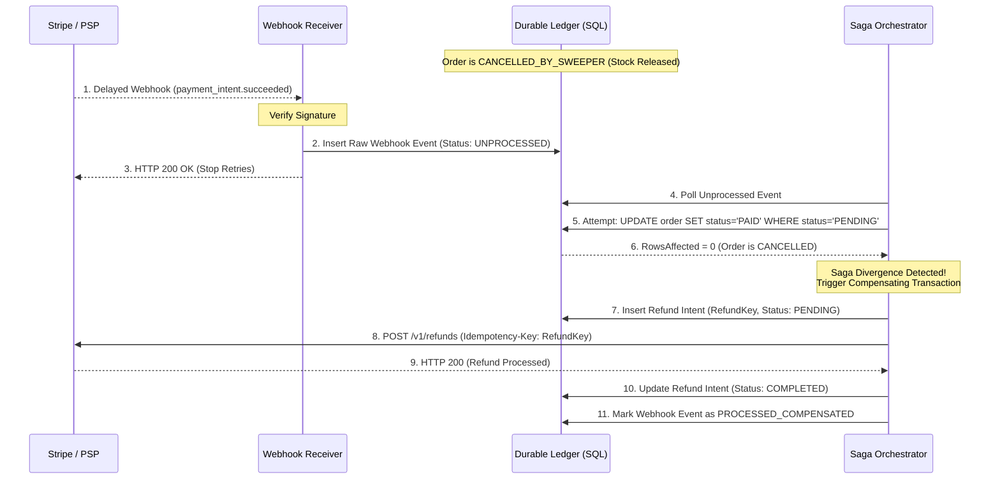

# 🧱 Engineering Brick: The Final Consistency Loop

> 🌸 *The inventory is locked, the ticket is signed,*
> *But until money moves, truth is blind.*

Welcome to the Grand Finale (Part 4) of the **Global Flash Sale Engine** series.

Let us trace the journey: In [Part 1](), the Edge layer absorbed the initial 1,000,000 requests. In [Part 2](), the Virtual Waiting Room paced the 100,000 eligible survivors. In [Part 3](), the Atomic Reservation Gate successfully protected the database from the Hot-Row Problem, allowing 1,000 users to secure a temporary lock on the inventory.

Now, the user has their reserved items in the cart and clicks **"Pay"**. 

This is where systems shatter. The boundary between your internal database and an external Payment Service Provider (PSP like Stripe or PayPal) is the most treacherous fault line in software architecture. Today, we confront the ultimate distributed anomaly: **The Late Webhook & The Sweeper's Blade**, and architect a resilient payment integration using Distributed Idempotency and the Saga Pattern.

---

## 🌠 Formal Specification: Problem Model

The payment subsystem must securely capture funds from an external provider and synchronize that state back to the internal order ledger, without double-charging the user or losing funds in transit.

**The Interface**:
* `initiatePayment(OrderID, ReservationToken, Amount) -> PaymentIntent`
* `webhookCallback(PaymentIntentID, Status) -> Ack`

**The Constraints**:
* **Strict Idempotency**: A user frantically clicking the "Pay" button 50 times during a network partition must result in exactly one charge.
* **Guaranteed Reconciliation**: If an external provider charges the user, our system must either deliver the goods or automatically issue a refund.
* **No Distributed Transactions (2PC)**: You cannot lock a Stripe database and your PostgreSQL database in the same transaction.

---

## 🔍 Context & Symptom: The Ghost Payment

Consider the most terrifying nightmare for an e-commerce engineer: **The Divergent Cancellation**.

1. A user holds a reservation for an iPhone (TTL: 10 minutes).
2. At minute 09:55, they authorize the payment on the PSP's hosted page.
3. The PSP charges the credit card successfully but experiences an internal queue delay, causing the success Webhook to be delayed by 2 minutes.
4. At minute 10:00, the reservation TTL expires. Our internal **Reconciliation Sweeper** (from Part 3) wakes up, transitions the order to `CANCELLED_BY_SWEEPER`, and releases the iPhone back to the inventory pool. Another user immediately buys it.
5. At minute 11:55, the PSP's delayed webhook arrives: *"Payment Successful for Order X"*.

**The Result**: The user has been charged $1,000, but their order is cancelled, and the physical phone has been sold to someone else. This is a fatal breach of data integrity and customer trust.

---

## 🏛️ Architectural Doctrine: Design for Compensation

When bridging two sovereign systems across an unreliable network, you must abandon the illusion of perfect, synchronous consistency. You cannot prevent the "Ghost Payment" anomaly from occurring; you can only architect a deterministic mechanism to heal it.

> **"In distributed systems, you don't prevent failure; you design the compensation."**

Instead of Two-Phase Commit, we embrace **The Saga Pattern**. A Saga is a sequence of local transactions where each step updates data within a single service and publishes an event or triggers the next step. If a step fails or violates a business invariant (like an expired order), the Saga executes a **Compensating Transaction** to undo the preceding steps.

There are two variants of the Saga pattern: **Choreography** (each service reacts to domain events published by others, with no central coordinator) and **Orchestration** (a single process explicitly sequences every step and drives compensation). We choose the **Orchestration** variant. Our `Async Worker` acts as the central Saga Orchestrator — it owns the full state machine: polling webhook events, attempting the conditional order update, detecting state divergence, issuing the refund, and writing every transition back to the durable ledger. This narrows the failure envelope to a single auditable process: when something goes wrong, there is exactly one place to inspect, replay, or alert.

In our scenario, a delayed payment landing on a cancelled order triggers an automatic, programmatic **Refund Flow** (the compensation).

---

## ⛩️ Integrity Boundary: Idempotency Key Lifecycle

To make compensation safe, every interaction with the external PSP must be strictly idempotent. Idempotency is not just a database unique constraint; it is a lifecycle.

Every state-changing PSP call (Charge, Refund) should carry an **Idempotency Key**.

* **Derivation**: The key must be deterministic and scoped to the reservation contract. For the initial charge, `IdempotencyKey = Hash(OrderID + ReservationToken + PaymentAttempt + Amount)`. For the refund, `RefundKey = Hash(PaymentIntentID + "REFUND")`.
* **Storage**: We store the Idempotency Key in a dedicated PostgreSQL table (`payment_idempotency_log`) *before* calling the PSP.
* **Expiration**: Idempotency keys at the PSP usually expire (e.g., Stripe expires them after 24 hours). Our internal system must maintain its own historical ledger of these keys indefinitely to prevent double-refunding a year later.

The two critical tables anchoring this lifecycle are:

```sql
-- The durable event log. Every inbound PSP webhook lands here first.
-- The Saga Orchestrator treats this table as its work queue.
CREATE TABLE webhook_events (
    id              UUID        PRIMARY KEY DEFAULT gen_random_uuid(),
    psp_event_id    TEXT        NOT NULL UNIQUE,   -- PSP's own event ID; prevents duplicate ingestion
    event_type      TEXT        NOT NULL,           -- e.g. 'payment_intent.succeeded'
    raw_payload     JSONB       NOT NULL,
    status          TEXT        NOT NULL DEFAULT 'UNPROCESSED',
    -- status values: UNPROCESSED | IN_PROCESSING | PROCESSED_OK | PROCESSED_COMPENSATED | DEAD_LETTER
    processing_until TIMESTAMPTZ,                  -- optimistic lease expiry (set by worker on claim)
    created_at      TIMESTAMPTZ NOT NULL DEFAULT NOW(),
    processed_at    TIMESTAMPTZ
);
CREATE INDEX ON webhook_events (status, processing_until)
    WHERE status IN ('UNPROCESSED', 'IN_PROCESSING');  -- narrow index for worker poll query

-- The payment ledger. Every PSP API call (charge or refund) is pre-registered here.
-- This is the source of truth that outlives PSP key expiry.
CREATE TABLE payment_idempotency_log (
    idempotency_key TEXT        PRIMARY KEY,        -- Hash(OrderID+ReservationToken+Attempt+Amount) or Hash(PaymentIntentID+"REFUND")
    order_id        UUID        NOT NULL REFERENCES orders(id),
    operation_type  TEXT        NOT NULL,           -- 'CHARGE' | 'REFUND'
    amount_cents    BIGINT      NOT NULL,
    psp_response    JSONB,                          -- raw PSP response, stored after call completes
    status          TEXT        NOT NULL DEFAULT 'PENDING',
    -- status values: PENDING | COMPLETED | FAILED
    created_at      TIMESTAMPTZ NOT NULL DEFAULT NOW(),
    completed_at    TIMESTAMPTZ
    -- No expiry column: this table is the permanent financial audit trail.
    -- PSP key expires in 24h; our record is retained indefinitely.
);
```

By strictly binding the charge key to the `ReservationToken`, we ensure that retries—whether driven by impatient users or network partitions—never spawn duplicate payment intents for the same reservation, while still allowing a legitimate later reservation to create a distinct payment attempt.

---

## 🧩 Architecture / Composition: Webhook Resilience

Webhooks from the PSP are the asynchronous truth-bearers of the payment integration. If your API server crashes while processing a webhook, you drop the payment state.

To build a **Drop-proof Event Queue**:
1. **The Webhook Receiver**: A lightweight, highly available API endpoint whose sole job is to verify the cryptographic signature of the webhook, save the raw JSON payload to a durable append-only log (e.g., PostgreSQL `webhook_events` table or a Kafka topic), and immediately return `HTTP 200 OK` to the PSP.
2. **The Processor (Async Worker)**: A background worker polls the `webhook_events` table, parses the payload, and executes the complex state machine transitions (Saga orchestration).

The key safety invariant here is **atomicity of local state transitions**. Each database transition the Orchestrator owns — claiming an event, inserting a Refund Intent, recording a completed refund — must be committed atomically with the state it protects. The PSP call itself is not part of that database transaction; it is made retry-safe by the durable intent row and the deterministic idempotency key. If an intermediate local step fails (e.g., the Refund Intent INSERT fails because the database is momentarily unavailable), the worker must throw an exception *without* marking the webhook event as processed. The event remains `UNPROCESSED`, and the next poll cycle retries the entire Saga from Step 4. This means every Saga step must be designed to be **idempotent on retry**: the conditional `UPDATE orders WHERE status='PENDING'` will again return `RowsAffected = 0`, the Refund Intent INSERT will use `ON CONFLICT DO NOTHING` against the deterministic `RefundKey`, and the PSP call will be safely deduplicated by the same key. The webhook event is the single, durable unit of work; the Orchestrator is stateless.

---

## 🌀 Timeline / Lifecycle: The Saga & Refund Flow

Let us model the timeline of the "Ghost Payment" recovery using the Saga pattern.

1. **Phase 1 (The Missed Deadline)**: The Sweeper cancels the order and releases stock because the webhook didn't arrive in time.
2. **Phase 2 (The Late Arrival)**: The Webhook Receiver captures the delayed `payment_intent.succeeded` event and durably stores it.
3. **Phase 3 (The Collision Check)**: The Async Worker processes the event. It attempts a conditional update on the Order table:
   `UPDATE orders SET status = 'PAID' WHERE id = 'X' AND status = 'PENDING';`
4. **Phase 4 (The Compensation)**: The database returns `RowsAffected = 0` because the order is `CANCELLED_BY_SWEEPER`. The worker detects the divergence.
5. **Phase 5 (The Refund)**: The worker initiates the compensating transaction. It generates a deterministic `RefundKey` and calls the PSP's Refund API. It logs the refund in the financial ledger.

### 🗺️ The Compensating Payment Saga



---

## ⚡ Socratic Review: Design Dialogue

*Let's stress-test the model against production chaos.*

> **🕵️ The Challenger**: Why immediately return `HTTP 200 OK` in the Webhook Receiver? Why not process the payment and return an error if it fails, so the PSP will retry?

**🧑‍💻 The Architect**:
Because coupling webhook reception to complex database transactions creates a cascading failure point. If our database is under heavy load (which it is, during a flash sale), the transaction will be slow. The PSP will time out, assume failure, and retry. Now you have the PSP aggressively DDoSing your infrastructure with retries while your database is already struggling. By decoupling ingestion (durability) from processing (orchestration), we protect the edge and control our own processing pace.

> **🕵️ The Challenger**: What if the API call to the PSP to issue the refund (Step 8) times out or fails? The user remains charged for a cancelled order.

**🧑‍💻 The Architect**:
This is exactly why we persist the `Refund Intent` (Step 7) in the database *before* calling the PSP. If the API call fails or the worker crashes, a separate background Cron job (The Financial Sweeper) continually scans for `Refund Intents` stuck in the `PENDING` state and retries the PSP call using the exact same deterministic `RefundKey`. Because the key is idempotent, the PSP will safely handle the retry without double-refunding.

---

## 📊 Matrix & Metrics: Illustrative Assumptions

*These numbers are illustrative assumptions for architectural reasoning, not benchmark claims:*

* **Flash Sale Volume**: 1,000 items, all reserved and proceeding to payment.
* **PSP Latency SLA**: p99 Webhook delivery < 5 seconds under normal load.
* **Degraded PSP Latency**: During massive global events, PSP queues can backlog, causing Webhook delays of 1-15 minutes.
* **Reservation Grace Period**: 10m User UI timeout + 30s technical grace period before the Sweeper cancels.
* **Webhook Ingestion Rate**: Must be capable of absorbing 10,000 webhooks/sec with <50ms latency (pure DB insert).

---

## 🪞 Failure Mode: What Breaks First

* **The Stale Cache Illusion**: The UI polls a Redis cache for payment status, but the cache is stale. The user thinks the payment failed, abandons the cart, but the webhook lands a second later. *Mitigation: The canonical truth is always the SQL ledger, not Redis. Cache invalidation must be driven by the database commit log — via PostgreSQL `LISTEN/NOTIFY` for a single-node setup, or a CDC tool like Debezium publishing to Kafka for a distributed deployment.*
* **The Stuck Worker / Zombie Lease**: The Async Worker picks up a webhook event, marks it `IN_PROCESSING`, and then crashes before completing. The event is now stuck — no other worker will touch it because it appears to be in flight. *Mitigation: Use an **optimistic lease** pattern. The worker sets `processing_until = NOW() + interval '5 minutes'` when claiming an event. A separate watchdog query (or the worker's next poll cycle) reschedules any event where `status = 'IN_PROCESSING' AND processing_until < NOW()`, resetting it to `UNPROCESSED`. Polling interval: every 2–5 seconds under normal load; back off to 30 seconds during DB pressure.*
* **The "Network Partition" Refund Failure**: We attempt the refund, but the external network to the PSP is entirely down for hours. *Mitigation: The Refund Intent queue acts as a shock absorber. Retries use exponential backoff with jitter (e.g., 1s → 2s → 4s → … → cap at 1 hour). A Financial Sweeper alerts a human operator if a refund remains PENDING for > 24 hours.*
* **Idempotency Key Collision**: Generating Idempotency Keys purely from a `UserID` instead of a highly specific transaction hash. This causes the PSP to ignore a legitimate second purchase attempt, assuming it's a retry of the first.
* **Thundering Webhooks (The Recovery Spike)**: When the PSP recovers from a prolonged delay, it may flush millions of queued webhooks simultaneously. If the Webhook Receiver writes directly to a relational database, this sudden spike can exhaust connection pools and take down the primary DB. *Mitigation: In extreme scale, bypass SQL for raw ingestion. The Webhook Receiver should stream payloads directly into an append-only distributed log (e.g., Kafka). The Async Worker then consumes from Kafka at a controlled, database-safe rate (Load Leveling).*

---

## 🔮Architect’s Crucible: Trade-offs

* **The Sync vs. Async Display Trade-off**: Should the UI wait synchronously for the webhook to update the database, or should it poll? We trade off UI simplicity for backend resilience. The UI must poll the backend for status (`/api/order/status`) while the backend asynchronously digests the webhook. The user might see a "Processing Payment..." spinner for a few seconds, but the system guarantees absolute data integrity.
* **The "Oversell" vs "Refund" Dilemma**: Some businesses prefer to never cancel a paid order, even if the stock is gone, and instead put the user on a backorder list. Our architecture explicitly chooses the **Strict Correctness** path: If the stock was legitimately reassigned by the Sweeper, the late payment is definitively a violation of the reservation contract, and a refund is the only mathematically sound compensation.
* **Saga Observability & The "Time to Compensate" SLI**: A Saga is invisible if you only monitor HTTP 500 error rates. An orchestration process can fail silently — the worker drops the event, no exception is thrown, no alert fires, and the user remains charged indefinitely. You must instrument the distributed state machine explicitly. The critical SLI here is the **Time to Compensate (TtC)**: the p99 latency between a late webhook arriving at the Receiver and the compensating refund reaching `COMPLETED` status in the ledger. The SLA for TtC is not an arbitrary engineering choice; it is bounded by **card network dispute windows**. Visa and Mastercard allow cardholders to initiate a chargeback up to 120 days after the transaction date. A chargeback is far more expensive than a voluntary refund (fees, operational overhead, potential dispute loss). Therefore: `SLA(TtC) << 120 days`. In practice, a well-run system targets p99 TtC < 1 hour, with a hard PagerDuty alert at > 24 hours. Any refund still PENDING at 24 hours represents a potential chargeback liability and must escalate to a human operator immediately.

---

## 🗝️ Brick Summary: Mental Model

* **🌠 Signal**: Interacting with an external Payment Gateway where network latency and asynchronous callbacks create state divergence.
* **🧩 Structure**: Saga Pattern + Bounded Idempotency Keys + Async Webhook Ingestion + Deterministic Compensation (Refund Flow).
* **🏛️ Invariant**: Never lock an external system and internal database together. Ingest durably, process asynchronously, and compensate automatically.
* **💠 Pivot Insight**: A successful charge on a cancelled order is not an error; it is a valid state in a distributed system that requires a programmed transition (The Refund).

---

🪷 *One sentence to trigger the reflex*: **"A ghost payment is not an anomaly; it is a distributed state awaiting its deterministic refund."**

### 🌅 Epilogue: The End of the Flash Sale

With the payment gateway secured and the Saga pattern elegantly handling our edge cases, our **Global Flash Sale Engine** is complete. We have journeyed from the chaotic Edge, through the Waiting Room, past the Atomic Inventory Gates, and finally sealed the truth in the Financial Ledger. 

But as we zoom out from this single transactional application, we realize a new problem: How do we synchronize this truth across an entire enterprise? How do thousands of microservices react to this single flash sale event? 

> **Next up**: We leave the realm of static databases and enter the world of flowing data. Join me in **Phase 2**, where we architect **The Global Nervous System**—exploring Kafka, the KRaft protocol, and the pursuit of Exactly-Once Semantics at a planetary scale.
